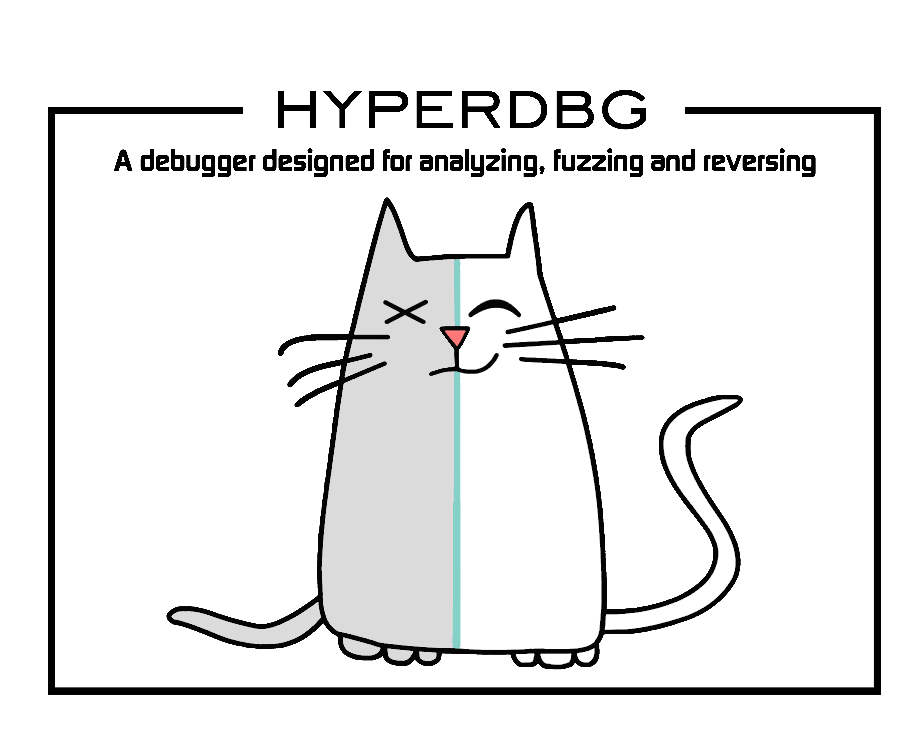

# HyperDbg Debugger

## What is it?

HyperDbg debugger is an open-source, user-mode, and kernel-mode debugger with a focus on using hardware technologies to provide new features to the debuggers’ world.

It is designed on top of Windows by virtualizing an already running system using Intel VT-x and Intel PT. This debugger aims not to use any APIs and software debugging mechanisms, but instead, it uses Second Layer Page Table \(a.k.a. Extended Page Table or EPT\) extensively to monitor both kernel and user executions.

HyperDbg comes with features like hidden hooks, which is as fast as old inline hooks, but also stealth. It mimics hardware debug registers for \(read & write\) to a specific location, but this time entirely invisible for both Windows kernel and the programs, and of course without any limitation in size or count!

Using TLB-splitting, and having features such as measuring code coverage and monitoring all mov\(s\) to/from memory by a function, makes HyperDbg a unique debugger.

Although it has novel features, HyperDbg tries to be as stealth as possible. It doesn’t use any debugging APIs to debug Windows or any application, so classic anti-debugging methods won’t detect it. Also, it resists the exploitation of time delta methods \(e.g., RDTSC/RDTSCP\) to detect the presence of hypervisors, therefore making it much harder for applications, packers, protectors, malware, anti-cheat engines, etc. to discover the debugger.

