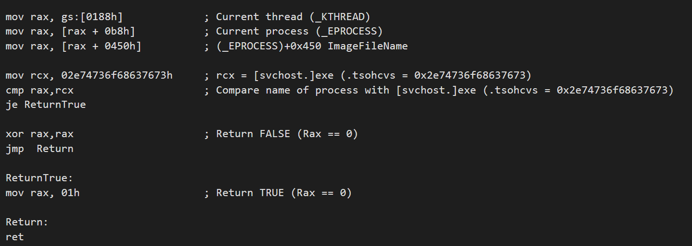

# !epthook \(hidden hook with EPT - stealth breakpoints\)

### Command

> !epthook

### Syntax

> !epthook \[address\] \[pid \(hex value\)\] \[core \(hex value\)\] \[event options\]

### Description

Put hidden breakpoint \(0xcc\) on the target function in user-mode and kernel-mode without modifying the content of memory in the case of read/write.


This implementation of hidden hook causes vm-exit when it triggers, a faster implementation of EPT hidden hooks is [!epthook2](https://docs.hyperdbg.com/commands/extension-commands/epthook2) which is without vm-exits, but it has some limitations as described in its manual.


### Parameters

**\[address\]**

          The **Virtual** address of where we want to put hook

**\[pid \(hex value\)\]**

          Optional value to trigger the event in just a specific process. Add `pid xx` to your command thus command will be executed if process id is equal to `xx`. If you don't specify this option then by default you receive events on all processes.

**\[core \(hex value\)\]**

          Optional value to trigger the event in just a specific core. Add `core xx` to your command thus command will be executed if core id is equal to `xx`. If you don't specify this option then by default you receive events on all cores.

**\[event options\]**

          Regular event parameters used in HyperDbg events. \(For more information read [this ](https://docs.hyperdbg.com/using-hyperdbg/prerequisites)topic\)

### Context

As the **Context** \(**`r8`** in custom code and **`rdx`** in condition code register\) to the event trigger, we send the **physical** address of where put the hidden hook's breakpoint.

### Debugger

This event supports three debugging mechanisms.

* Break to Debugger
* Log the States
* Run Custom Code


Please read  "[How to create a condition?](https://docs.hyperdbg.com/using-hyperdbg/prerequisites/how-to-create-a-condition)" if you need a conditional event, a conditional event can be used in all "**Break to Debugger**", "**Log the State**" and "**Run Custom Code**".


### Break to Debugger

Imagine we want to put a hook on ``fffff800`4ed6f010``, this will breaks to the debugger when the target address hits and gives the control back to you.

```c
!epthook fffff800`4ed6f010 
```

### Log the States

Not Completed Yet !

### Run Custom Code

Please read  "[How to create an action?](https://docs.hyperdbg.com/using-hyperdbg/prerequisites/how-to-create-an-action)" for getting idea about how to run custom buffer code in **HyperDbg**.


Your custom code will be executed in vmx-root mode. Take a look at [this topic](https://docs.hyperdbg.com/tips-and-tricks/considerations/vmx-root-mode-vs-vmx-non-root-mode) for more information. Running code in vmx-root is considered "[unsafe](https://docs.hyperdbg.com/tips-and-tricks/considerations/the-unsafe-behavior)".


#### Run Custom Code \(Unconditional\)

As an example, we want to find the _TAG_ \(**ExAllocatePoolWithTag**\) if the tag is a special value then we want to change it to a new value.

As you, ExAllocatePoolWithTag in Windows is defined as:

```c
PVOID ExAllocatePoolWithTag(
  POOL_TYPE                                      PoolType,
  SIZE_T                                         NumberOfBytes,
  ULONG                                          Tag
);
```

Based on the x64 calling convention, the parameters are passed as **rcx**, **rdx**, **r8**, **r9,** and stack and _Tag_ is on **r8**.

As you know, if you want to change a register in the target OS, you have to find the register in _Regs_ and change it from there. Based on `_GUEST_REGS`, **r8** is on **0x40** from the top of this structure.

Take a look at the following assembly code, it first checks whether the _Tag_ \(**r8**\) is **HDBG** and if it's **HDBG** then we change it to **HDB2**.


When we convert the above code to assembly then we have the following code :

```c
0:  48 8b 5a 40             mov    rbx,QWORD PTR [rdx+0x40]
4:  48 81 fb 48 44 42 47    cmp    rbx,0x47424448
b:  74 02                   je     f <ChangeIt>
d:  eb 08                   jmp    17 <Return>
000000000000000f <ChangeIt>:
f:  48 c7 42 40 48 44 42    mov    QWORD PTR [rdx+0x40],0x32424448
16: 32
0000000000000017 <Return>:
17: c3                      ret
```

Imagine, the **ExAllocatePoolWithTag** is located at ``fffff800`4ed6f010``. We can hook and change the Tag using the following command.

```c
!epthook fffff800`4ed6f010 code {488B5A404881FB484442477402EB0848C7424048444232C3}
```

#### Run Custom Code \(Conditional\)

In the above example, we add a condition like this:

Imagine we want to check for the name of the process so only and only if the name contains the "**svchost.exe**" then trigger the event's action\(s\).

We all know that you can search for the name of the process in its `_EPROCESS`.


For example, **ImageFileName** in **\_EPROCESS** contains the 15 characters of the process name. It is not where Windows shows the name in Task Manager but checking this value is enough.

The following assembly code, gets the current `_KTHREAD` from `_KPCR`. From there we can find the address of `_KPROCESS` and this structure is located at the start address of `_EPROCESS`. 

As you can see from the above picture, **ImageFileName** is located at `+0x450` after the `_EPROCESS`.

So our final assembly code is like this : 




The offsets of `_EPROCESS`and other structures might change in the different versions of Windows. 


Now we should assemble the above code into its hex representation in the assembly. For example, you can use an [online assembler](http://defuse.ca/online-x86-assembler.htm). 

Keep in mind that if you return with `rax=0` or `null` then it means **false** and if your return anything other than zero \(for example `rax=1`\) then it means **true**.

If you return true then all the actions of that event will be executed and if you return **false**, then **HyperDbg** ignores the actions of that event.

The final result of the assembler is :

```c
0:  65 48 8b 04 25 88 01    mov    rax,QWORD PTR gs:0x188
7:  00 00
9:  48 8b 80 b8 00 00 00    mov    rax,QWORD PTR [rax+0xb8]
10: 48 8b 80 50 04 00 00    mov    rax,QWORD PTR [rax+0x450]
17: 48 b9 73 76 63 68 6f    movabs rcx,0x2e74736f68637673
1e: 73 74 2e
21: 48 39 c8                cmp    rax,rcx
24: 74 05                   je     2b <ReturnTrue>
26: 48 31 c0                xor    rax,rax
29: eb 07                   jmp    32 <Return>
000000000000002b <ReturnTrue>:
2b: 48 c7 c0 01 00 00 00    mov    rax,0x1
0000000000000032 <Return>:
32: c3                      ret
```

Now you can call the command with the following arguments \(condition code added to the above example\) :

```c
!epthook fffff801deadbeef code {488B5A404881FB484442477402EB0848C7424048444232C3} condition {65488B042588010000488B80B8000000488B805004000048B9737663686F73742E4839C874054831C0EB0748C7C001000000C3}
```


Keep in mind, a conditional event can be used in **Break to Debugger** and **Log the State** too.


### IOCTL

This command uses the same method to [send IOCTL for regular events](https://docs.hyperdbg.com/design/debugger-internals/ioctl-requests-for-events). 

Use `HIDDEN_HOOK_EXEC_CC` as **EventType**, ****and send the address of where you want to hook in `OptionalParam1`in **DEBUGGER\_GENERAL\_EVENT\_DETAIL**.

### Design

Take a look at "[Design of !epthook](https://docs.hyperdbg.com/design/features/design-of-epthook)" to see how does it work.

### **Remarks**

This command is much slower than **!epthook2**, ****because it cause vm-exits but on the other hand, this implementation doesn't have any limitation, for example you can use this command for hooking user-mode while you can't use **!epthook2** on user-mode.

### Requirements

Post-Nehalem Processor \(EPT\)

Processor with Execute-only Pages Support

### Related

[!epthook2 \(hidden hook with EPT - detours\)](https://docs.hyperdbg.com/commands/extension-commands/epthook2)

