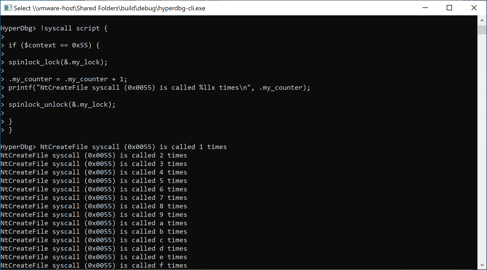

# access to a shared variable from different cores

Sharing memory (variables) between different cores is tricky.

Imagine we want to count the number of times that `nt!NtCreateFile` system-calls are called in our system.

We know that the syscall number for `nt!NtCreateFile` is **0x55**.

In the [!syscall](https://docs.hyperdbg.org/commands/extension-commands/syscall#context) command, both `$context` and **RAX **register contain the syscall number.

One of the solutions to avoid simultaneous read/write from the shared objects (global variables) is using [spinlocks](https://en.wikipedia.org/wiki/Spinlock).

[Spinlocks](https://docs.hyperdbg.org/commands/scripting-language/functions/spinlocks) are implemented through functions in the script engine.

First of all, we should define two global variables. One to be used as the counter and the other is used as the [lock](https://en.wikipedia.org/wiki/Lock_\(computer_science\)).

The can be achieved by using the following commands.

```
? .my_lock = 0;
? .my_counter = 0;
```


Keep in mind, that the lock variable should be a global variable, not a local variable.


Now, we protect the [critical section](https://en.wikipedia.org/wiki/Critical_section) by using [spinlock_lock](https://docs.hyperdbg.org/commands/scripting-language/functions/spinlocks/spinlock_lock) function.

```
spinlock_lock(&.my_lock); 

.my_counter = .my_counter + 1;
printf("NtCreateFile syscall (0x0055) is called %llx times\n", .my_counter);
	
spinlock_unlock(&.my_lock);
```

By using spinlocks we are sure that two (or more) cores we'll never execute our critical section and only one core is executing the critical section at the same time and other cores will wait till the current core releases the lock.


If you don't use spinlocks and access to the global variables without using a lock then your result might not be true as the debuggee might (and will) run the script simultaneously in two cores and your code has the classic problem of [concurrent reading of shared memory](https://en.wikipedia.org/wiki/Concurrent_computing) in multi-core environment.


To wrap up, we'll use the following script to accomplish the above task.

```clike
? .my_lock = 0;
? .my_counter = 0;

!syscall script {

if ($context == 0x55) {

	spinlock_lock(&.my_lock); 
	
	.my_counter = .my_counter + 1;
	printf("NtCreateFile syscall (0x0055) is called %llx times\n", .my_counter);
	
	spinlock_unlock(&.my_lock);

	}
}
```

You can see the result of the above command:



