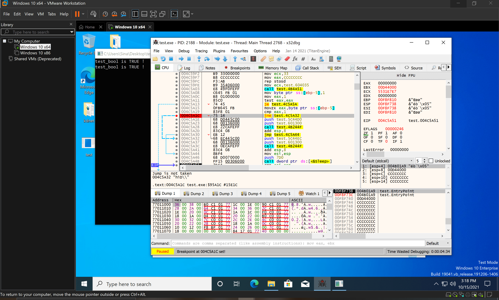

# patch the normal sequence of execution

```clike
#include <iostream>
#include <Windows.h>

int main()
{
    bool test_bool = true;

	while (true)
	{
		if (test_bool == true)
		{
			std::cout << "test_bool is TRUE !\n";
		}
		else
		{
			std::cout << "test_bool is FALSE !\n";
		}

		Sleep(2000);
	}
}
```



```clike
!epthook 004C5A1C pid 225c script {
	@zf = 0;
}
```
