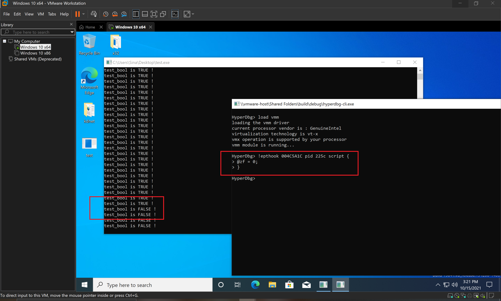
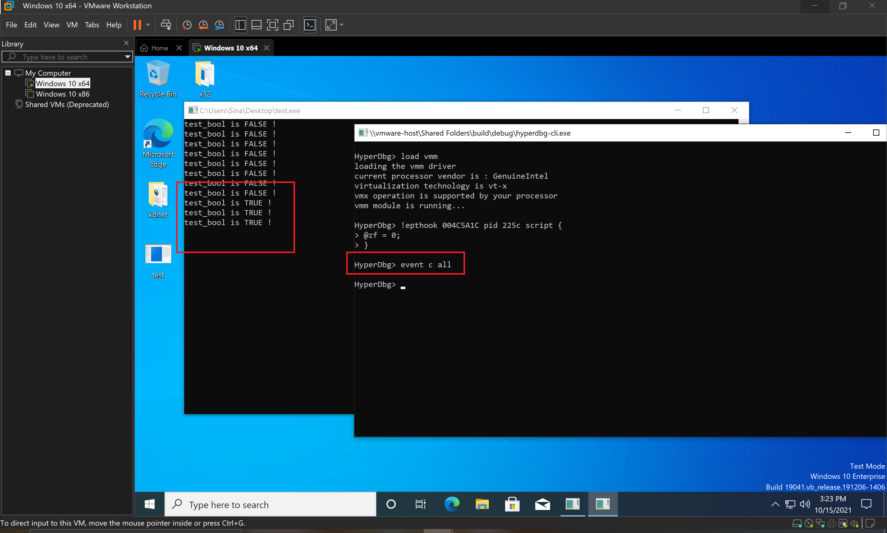

# patch the normal sequence of execution

One of the powerful features of HyperDbg's script engine is its ability to change the target program's normal execution flow. These changes are applied from the hypervisor level, so it's hidden from the program's layer.

To demonstrate an example of this method, we compiled the following C++ program. A simple infinite loop that always shows a message (`"test_bool is TRUE !\n"`). It's because the `test_bool` variable is filled with `ture`.

```clike
#include <iostream>
#include <Windows.h>

int main()
{
    bool test_bool = true;

	while (true)
	{
		if (test_bool == true)
		{
			std::cout << "test_bool is TRUE !\n";
		}
		else
		{
			std::cout << "test_bool is FALSE !\n";
		}

		Sleep(2000);
	}
}
```

You can use your favorite static analyzer like IDA Pro, or Ghidra to see the source code, but in this example, I used [x64dbg](https://x64dbg.com) to show you what exactly we want to patch. As you can see the above code is converted to the following assembly codes and our condition `if (test_bool == true)` is assembled at `004C5A1C` with a **JNE** instruction.


As you might know, **JNE** instruction decides whether to perform the jump or not based on the **Zero Flag**. Thus, if we change the `@zf` register then the jump is performed and we should see the second message (`"test_bool is FALSE !\n"`).

Note that in our case, the process id is **225c**.

So, we use the following hidden breakpoint to change the **@zf** flag.

```clike
!epthook 004C5A1C pid 225c script {
	@zf = 0;
}
```


In the above script, you can change all of the registers that are supported by HyperDbg, like general-purpose register, RFLAGS, etc.


Now, let's test our theory, if we run the above HyperDbg script, we can see that the message is changed.



If we clear the event, we can see that the results are returned to the previous form.



This was an example of changing the program's flow without attaching to the target process. You can also change the memory using [eb, ed, eq](https://docs.hyperdbg.org/commands/scripting-language/functions/memory/eb-ed-eq) functions.
