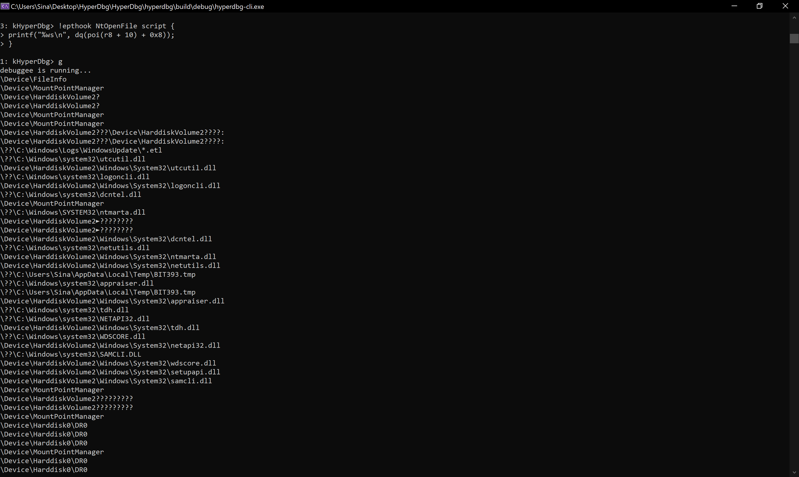

# trace function calls

Creating logs from different APIs and functions is one of the essential tasks in reverse engineering and program or malware analysis. HyperDbg is optimized to be fast and accurate for this case.

Assume that we want to create a log from all the files that a process wants to open. For this case, we want to hook [**nt!NtOpenFile**](https://docs.microsoft.com/en-us/windows/win32/api/winternl/nf-winternl-ntopenfile). 


Note that there are other functions to get the handle from files, e.g., [**nt!NtCreateFile**](https://docs.microsoft.com/en-us/windows/win32/api/winternl/nf-winternl-ntcreatefile) but for this example, we only use **nt!NtOpenFile**. You can create your scripts for other functions too.


From the [MSDN](https://docs.microsoft.com/en-us/windows/win32/api/winternl/nf-winternl-ntopenfile), **NtOpenFile** is defined like this:

```c
__kernel_entry NTSYSCALLAPI NTSTATUS NtOpenFile(
  PHANDLE            FileHandle,
  ACCESS_MASK        DesiredAccess,
  POBJECT_ATTRIBUTES ObjectAttributes,
  PIO_STATUS_BLOCK   IoStatusBlock,
  ULONG              ShareAccess,
  ULONG              OpenOptions
);
```

As you might know, there is no pointer to the file name in the above prototype. In fact, the file name's pointer is embedded into the **ObjectAttributes** parameter to this function.

If you want to see how **OBJECT_ATTRIBUTES** structure is defined, you can see [this](https://docs.microsoft.com/en-us/windows/win32/api/ntdef/ns-ntdef-\_object_attributes) link from MSDN.

```c
typedef struct _OBJECT_ATTRIBUTES {
  ULONG           Length;
  HANDLE          RootDirectory;
  PUNICODE_STRING ObjectName;
  ULONG           Attributes;
  PVOID           SecurityDescriptor;
  PVOID           SecurityQualityOfService;
} OBJECT_ATTRIBUTES;
```

From the relative-address point of view, this function is stored in the memory like this:

```
   +0x000 Length           : Uint4B
   +0x008 RootDirectory    : Ptr64 Void
   +0x010 ObjectName       : Ptr64 _UNICODE_STRING
   +0x018 Attributes       : Uint4B
   +0x020 SecurityDescriptor : Ptr64 Void
   +0x028 SecurityQualityOfService : Ptr64 Void
```

We can see that there is a [**UNICODE_STRING**](https://docs.microsoft.com/en-us/windows/win32/api/subauth/ns-subauth-unicode_string) field named **ObjectName**. This is the name of the object that we're trying to open using **NtOpenFile**. This structure is also used in** **[**NtCreateFile**](https://docs.microsoft.com/en-us/windows/win32/api/winternl/nf-winternl-ntcreatefile).

If we look at the **UNICODE_STRING** structure. It's defined like this:

```
typedef struct _UNICODE_STRING {
  USHORT Length;
  USHORT MaximumLength;
  PWSTR  Buffer;
} UNICODE_STRING, *PUNICODE_STRING;
```

And the compiler saves it like this:

```
   +0x000 Length           : Uint2B
   +0x002 MaximumLength    : Uint2B
   +0x008 Buffer           : Ptr64 Wchar
```

Ok, we have all the offsets that we want to create a log from the file names.

First, the **ObjectAttributes** parameter is passed as the **3rd** parameter to the function, and as the calling convention is Windows fastcall (**rcx**, **rdx**, **r8**, **r9**, **stack**), our target parameter is located at **r8**.

In our case, **r8** is a pointer to the **OBJECT_ATTRIBUTES**, and if we add **0x10** to it, we'll reach the **ObjectName** field of this structure.

**ObjectName** is a pointer to the **UNICODE_STRING**, so we'll dereference this pointer using thr `poi` operator to reach the top of the **UNICODE_STRING**.

In the **UNICODE_STRING**, we'll add **0x8** to get the **Buffer** filed of this structure, and now we dereference it again to get the pointer where the file name string is located.

We'll put a breakpoint on this function and use [print](https://docs.hyperdbg.org/commands/debugging-commands/print) and [dc](https://docs.hyperdbg.org/commands/debugging-commands/d) commands to verify our computation.

```clike
0: kHyperDbg> bp nt!NtOpenFile

0: kHyperDbg> g
debuggee is running...
breakpoint 0x1 hit
fffff801`6366cc40    4C 8B DC                            mov r11, rsp

3: kHyperDbg> print dq(poi(r8 + 10) + 0x8)
fffff801637c11f0

3: kHyperDbg> dc fffff801637c11f0
fffff801`637c11f0  0044005C 00760065 00630069 005C0065  \.D.e.v.i.c.e.\.
fffff801`637c1200  006F004D 006E0075 00500074 0069006F  M.o.u.n.t.P.o.i.
fffff801`637c1210  0074006E 0061004D 0061006E 00650067  n.t.M.a.n.a.g.e.
fffff801`637c1220  00000072 CCCCCCCC CCCCCCCC CCCCCCCC  r...............
fffff801`637c1230  004B005C 00720065 0065006E 004F006C  \.K.e.r.n.e.l.O.
fffff801`637c1240  006A0062 00630065 00730074 004C005C  b.j.e.c.t.s.\.L.
fffff801`637c1250  0077006F 006F004E 0050006E 00670061  o.w.N.o.n.P.a.g.
fffff801`637c1260  00640065 006F0050 006C006F 006F0043  e.d.P.o.o.l.C.o.
```

You can clearly see that the computed address contains the object name.

Now, we'll show it using [printf](https://docs.hyperdbg.org/commands/scripting-language/functions/exports/printf) function with `%ws` as the identifier to show the buffer as unicode string.

```clike
3: kHyperDbg> ? printf("%ws\n", dq(poi(r8 + 10) + 0x8));
\Device\MountPointManager
```

Next, we clear all the breakpoints using the [bc](https://docs.hyperdbg.org/commands/debugging-commands/bc) command.

```clike
3: kHyperDbg> bc all
```

All in all, we set a hook to this function using [!epthook](https://docs.hyperdbg.org/commands/extension-commands/epthook) command and in the script payload of the command, we use the stathat we made above.

```
!epthook nt!NtOpenFile script {
	printf("%ws\n", dq(poi(r8 + 10) + 0x8));
}
```

You can see the results of how it shows every objects name when you continue the debuggee.



