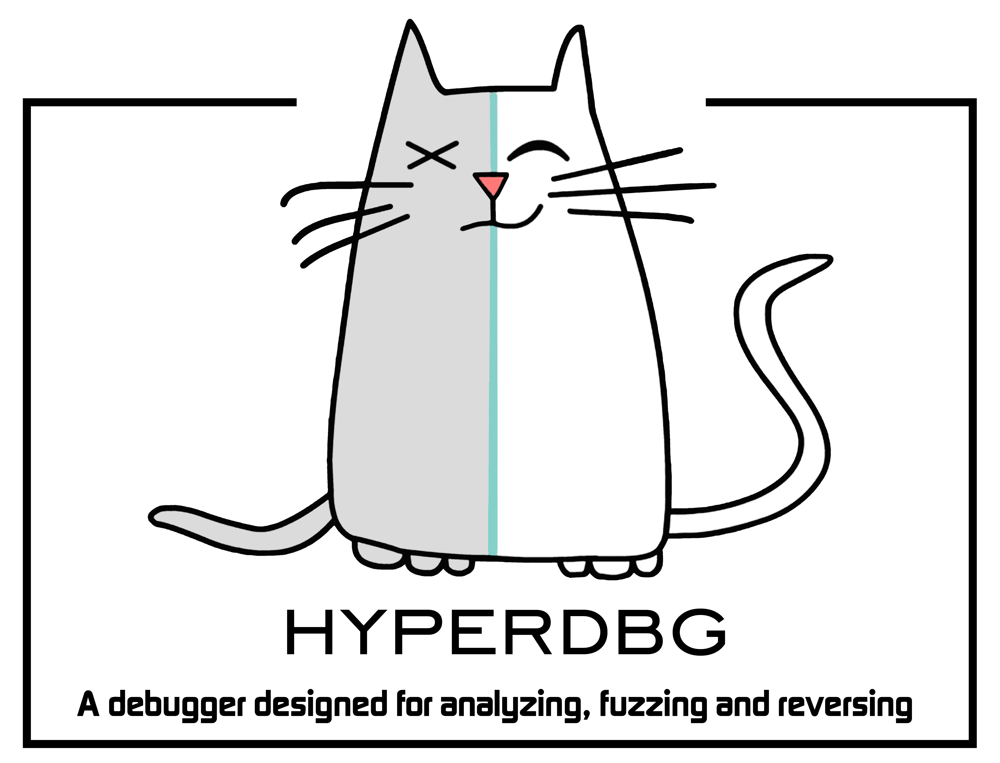
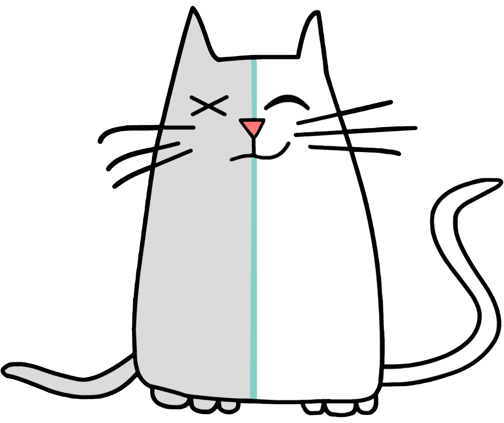
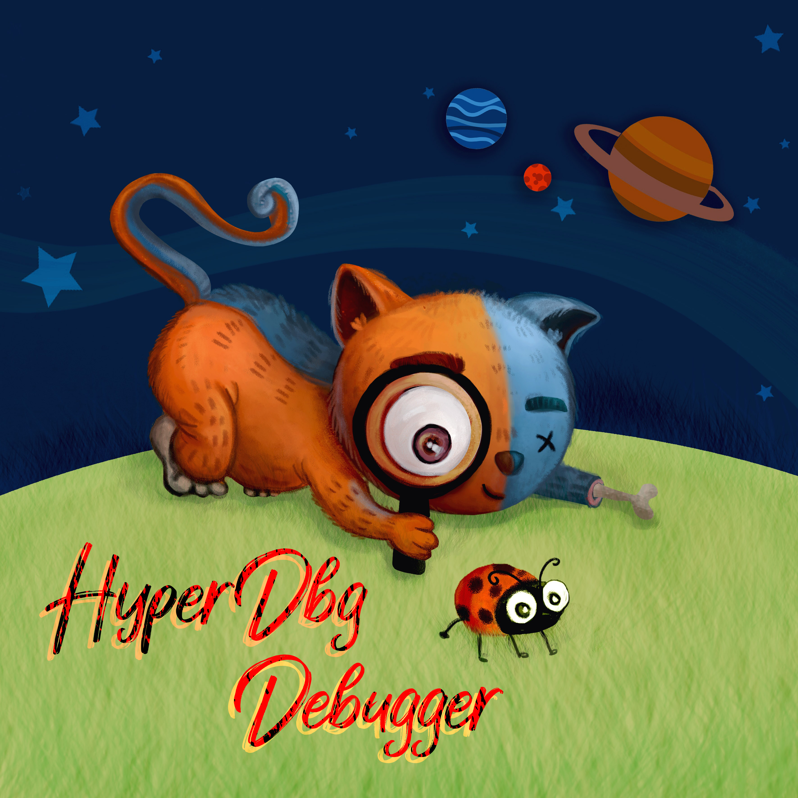

# Logo & Artworks

HyperDbg's logo is a **Schrödinger's cat**, which is both alive and/or dead. It's because we love quantum physics.

Here are some of the artworks you can use :

Here's another one!

Here's a HyperDbg cat without text.

Here's a HyperDbg Sticker :

