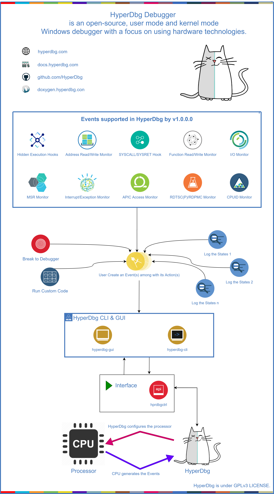

# Debugger Internals

**HyperDbg** is designed based on Hypervisor From Scratch tutorial.

It's a hypervisor plus some other processor features exported to user-mode to make debugging applications and the kernel possible.

## Tutorials

Here is the link to these parts:

### **Part 1 - Basic Concepts & Configure Testing Environment**

 \([https://rayanfam.com/topics/hypervisor-from-scratch-part-1/](https://rayanfam.com/topics/hypervisor-from-scratch-part-1/)\)

### **Part 2 - Entering VMX Operation**

\([https://rayanfam.com/topics/hypervisor-from-scratch-part-2/](https://rayanfam.com/topics/hypervisor-from-scratch-part-2/)\)

### **Part 3 - Setting up Our First Virtual Machine**

\([https://rayanfam.com/topics/hypervisor-from-scratch-part-3/](https://rayanfam.com/topics/hypervisor-from-scratch-part-3/)\)

### **Part 4 - Address Translation Using Extended Page Table \(EPT\)**

\([https://rayanfam.com/topics/hypervisor-from-scratch-part-4/](https://rayanfam.com/topics/hypervisor-from-scratch-part-4/)\)

### **Part 5 - Setting up VMCS & Running Guest Code**

\([https://rayanfam.com/topics/hypervisor-from-scratch-part-5/](https://rayanfam.com/topics/hypervisor-from-scratch-part-5/)\)

### **Part 6 - Virtualizing An Already Running System** 

\([https://rayanfam.com/topics/hypervisor-from-scratch-part-6/](https://rayanfam.com/topics/hypervisor-from-scratch-part-6/)\)

### **Part 7 - Using EPT & Page-Level Monitoring Features** 

\([https://rayanfam.com/topics/hypervisor-from-scratch-part-7/](https://rayanfam.com/topics/hypervisor-from-scratch-part-7/)\)

### **Part 8 - How To Do Magic With Hypervisor!** 

\([https://rayanfam.com/topics/hypervisor-from-scratch-part-8/](https://rayanfam.com/topics/hypervisor-from-scratch-part-8/)\)

## HyperDbg Source Code

You can see the source code for these series on GitHub.

\([https://github.com/SinaKarvandi/Hypervisor-From-Scratch](https://github.com/SinaKarvandi/Hypervisor-From-Scratch)\)

## HyperDbg Design 

Here's a diagram that shows how HyperDbg works!

