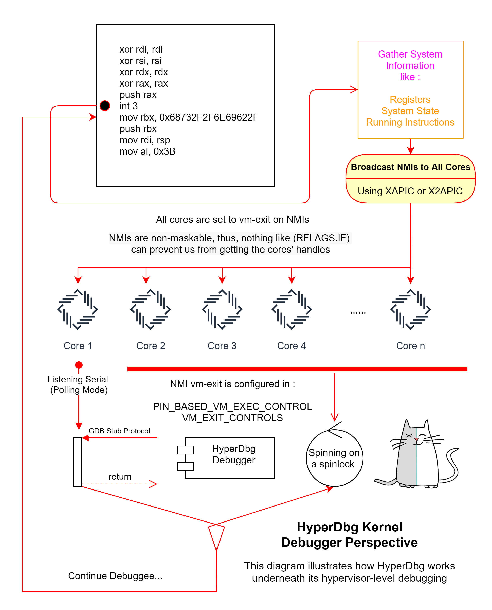

# Design Prospective

The following diagram illustrates how HyperDbg works on its kernel debugging mechanism.

Based on the design of HyperDbg, all the cores are halt and spinning on ring -1 \(hypervisor\).

Only the first core is listening for new commands from the debugger on a polling mode serial. 

There are two scenarios in which the kernel debugger is paused.

1. The user requests a pause \(for example, by pressing CTRL+C\) then it sends a packet to pause the debugger and the debuggee starts processing the packet from user-mode and invokes an IOCTL and that IOCTL executes a VMCALL and goes from kernel to vmx-root.
2. A breakpoint is triggered either by a break request from an event or from the script engine. There are two possible scenarios, first, if the user is in kernel-mode then a VMCALL happens and if the user is already in vmx-root mode then we should notify all the other cores.

In order to notify all the other cores, we send NMIs to all the cores using XAPIC or X2APIC. All the cores are configured to cause vm-exit in the case of NMIs \(PIN-Based VM-Exec controls are set to 1\).

Now, all the cores are in vmx-root mode and spinning and waiting for a new command from the debugger.

