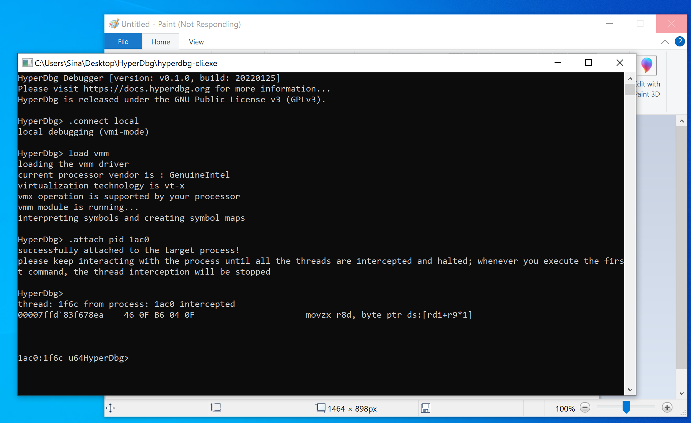
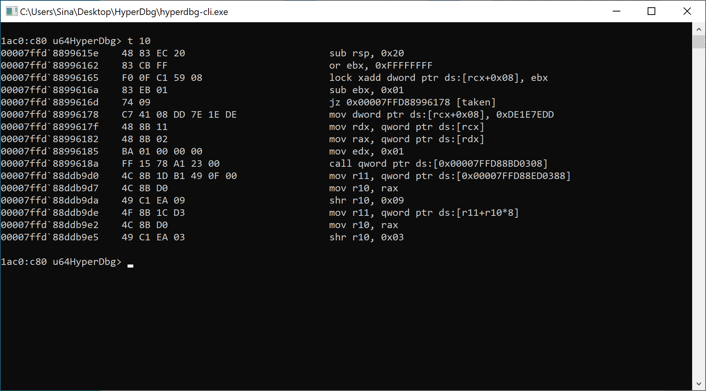
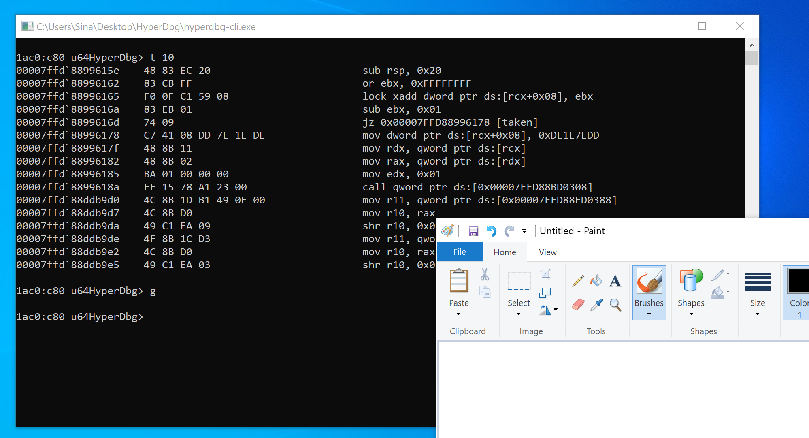
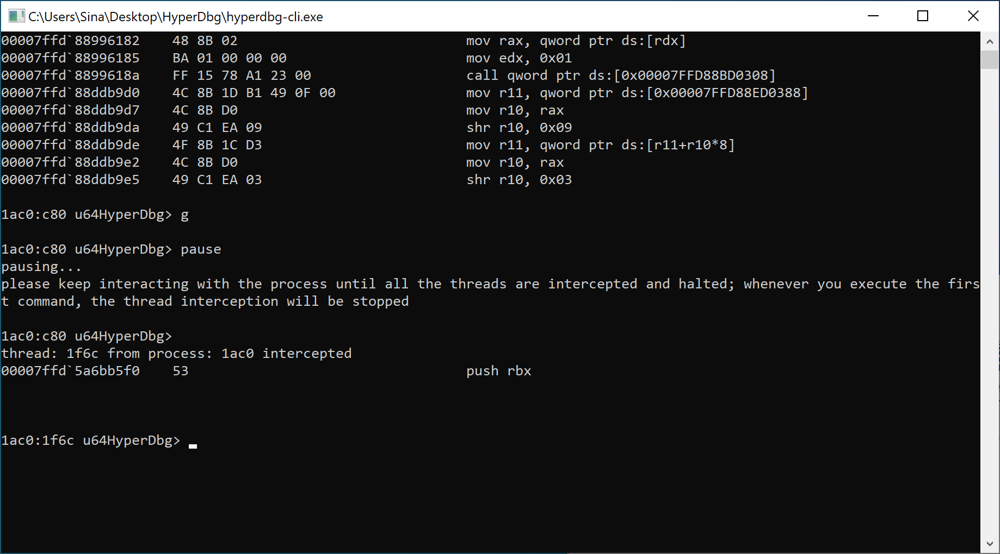
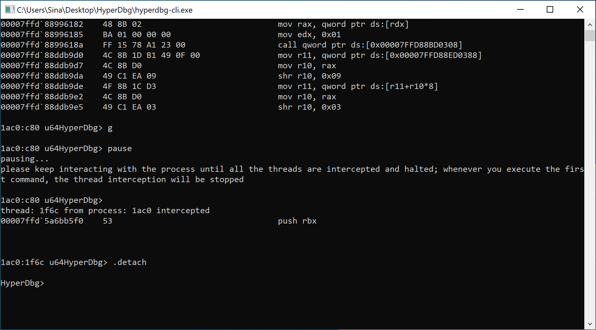

# Attach to a running process

Attaching to an already running process is crucial for debugging. HyperDbg implemented attaching in [VMI Mode](https://docs.hyperdbg.org/using-hyperdbg/prerequisites/operation-modes#vmi-mode). If you want to use the mechanism in [Debugger Mode](https://docs.hyperdbg.org/using-hyperdbg/prerequisites/operation-modes#debugger-mode), you can use the '[.process](https://docs.hyperdbg.org/commands/meta-commands/.process)' and the '[.thread](https://docs.hyperdbg.org/commands/meta-commands/.thread)' commands.

Please read the article [**here**](https://docs.hyperdbg.org/getting-started/attach-to-hyperdbg/start-process) if you want to start a process and debug it from the **entrypoint**.


In contrast with the kernel debugger, the user debugger is still very basic and needs a lot of tests and improvements. We **highly recommend** not to run the user debugger in your bare metal system. Instead, run it on a [supported virtual machine](https://docs.hyperdbg.org/tips-and-tricks/nested-virtualization-environments/supported-virtual-machines) to won't end up with a Blue Screen of Death (BSOD) in your primary device. Please keep reporting the issues to improve the user debugger.


Please make sure to read the user debugger's [principles](https://docs.hyperdbg.org/using-hyperdbg/user-mode-debugging/principles) before using the '[.attach](https://docs.hyperdbg.org/commands/meta-commands/.attach)' command.

After [connecting to the debuggee in VMI Mode (local debugging)](https://docs.hyperdbg.org/getting-started/attach-to-hyperdbg/local-debugging), you can run the following command to start the "[**Thread Interception**](https://docs.hyperdbg.org/using-hyperdbg/user-mode-debugging/principles#what-to-know)" phase.

The process Id should be in **hex** format. We chose "**mspaint**" for debugging.

After intercepting the user mode running threads, we can now step through the instructions.

Note that all the intercepted threads are halted when running a single-step command.

After running the '[g](https://docs.hyperdbg.org/commands/debugging-commands/g)' command, HyperDbg will normally continue the target debuggee process.

If you want to pause the debuggee and intercept the user running threads again, you can either use the '[pause](https://docs.hyperdbg.org/commands/debugging-commands/pause)' command or press **CTRL+C**.

Note that you should keep interacting with the process to force the process to run its codes in user-mode so HyperDbg will intercept more threads.

At last, we can detach from the target process by using the '[.detach](https://docs.hyperdbg.org/commands/meta-commands/.detach)' command.

In this article, we've learned how to use the user debugger to attach to the target process.
