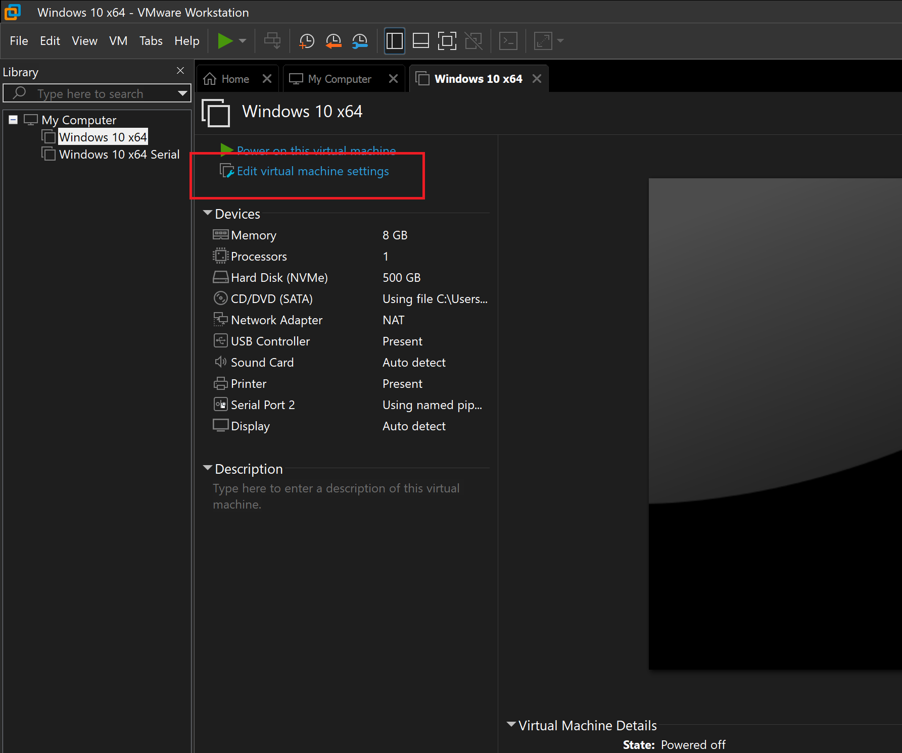
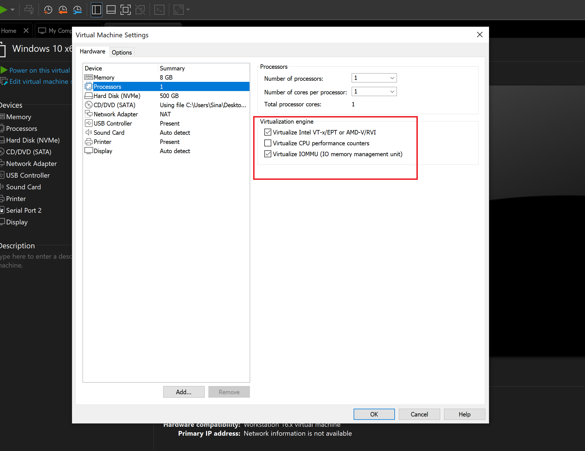
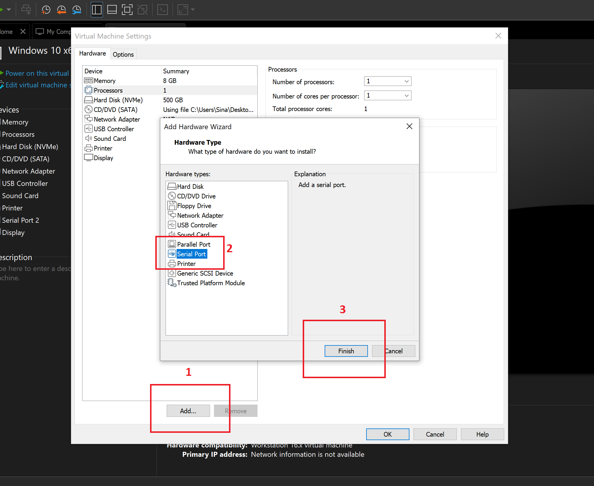
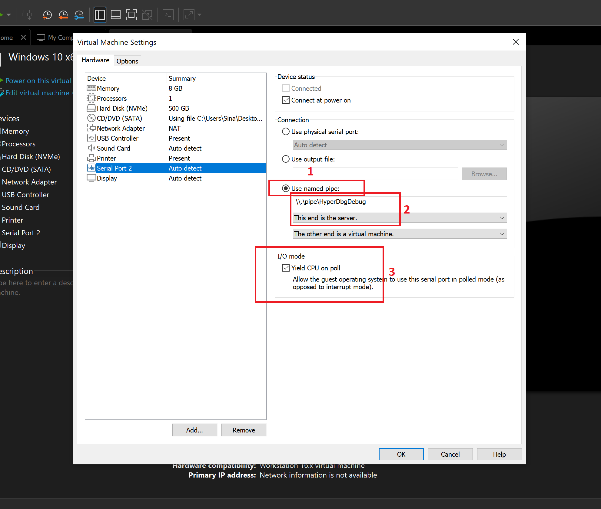
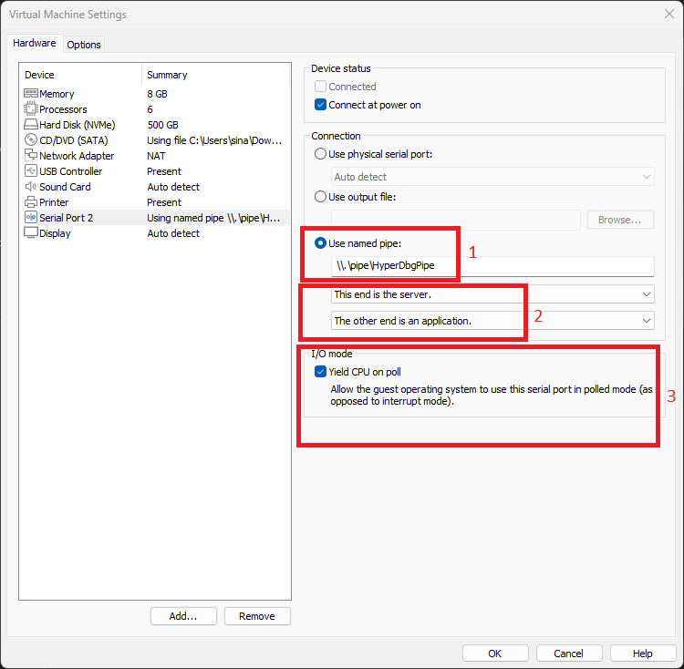
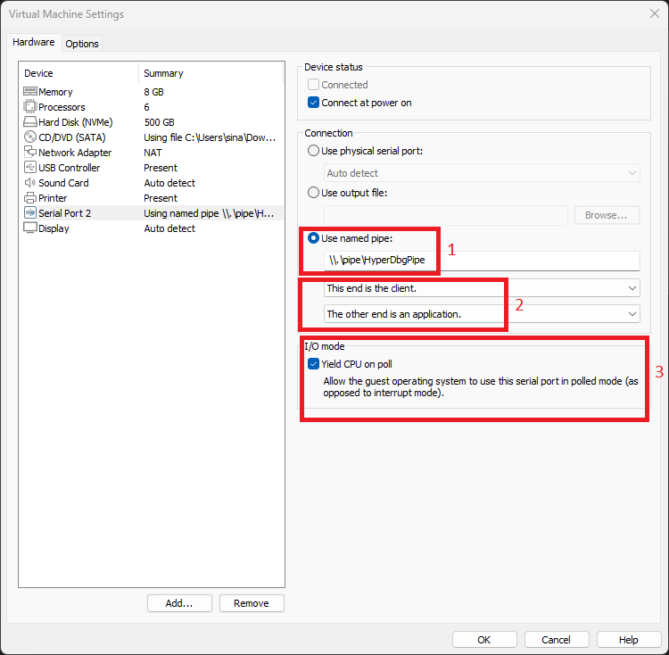
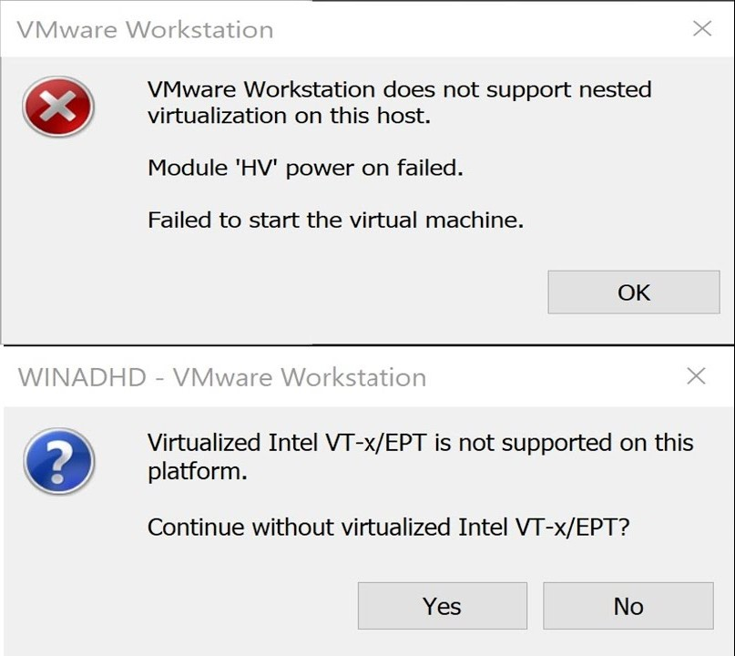

# Attach to a remote machine

If you have access to a remote physical machine or a nested virtualization environment like (VMware Workstation, VirtualBox, Hyper-V, etc.), you can **operate** in both [**VMI Mode**](https://docs.hyperdbg.org/using-hyperdbg/prerequisites/operation-modes#vmi-mode) and [**Debugger Mode**](https://docs.hyperdbg.org/using-hyperdbg/prerequisites/operation-modes#debugger-mode).

In **VMI Mode**, you can't break the kernel mode and step through the kernel instructions; still, you can step and break user-mode applications. This mode needs a network connection (TCP).

In **Debugger Mode**, you can break the kernel mode and step through the kernel instructions. It needs a serial (cable or virtual device) to connect to the target machine.


If you've attempted all the provided instructions without success, we encourage you to initiate a '[discussion](https://github.com/orgs/HyperDbg/discussions)'. Outline your issue comprehensively, and we'll be more than happy to assist you in getting started with HyperDbg :)


## Downloading VMware

HyperDbg works best with VMware Workstation Player/Pro.

You can download VMware Workstation Player (Free Non-commercial License) at: \[[https://www.vmware.com/products/workstation-player/workstation-player-evaluation.html](https://www.vmware.com/products/workstation-player/workstation-player-evaluation.html)]

After that, you should install your desired operating system (Windows 10, or 11) on your VMware as a guest. Once, you finished installing your virtual machine, you can continue the rest of this article.

Here is a quick video that describes how to set up HyperDbg with VMware Workstation Pro/Player.


Getting Started with HyperDbg


## Connect to Debuggee (Debugger Mode)

For connecting in debugger mode, first, you need to provide a serial device.

### **Physical Machine (Host)**

In order to connect to a physical machine in debugger mode, you need a physical serial port. After that, connect your target machine (debuggee) to another machine.

Debuggee needs to support Intel VMX and Intel EPT; however, the debugger does not need to support any special CPU feature and can be run on any machine, including a machine with an AMD processor.

If you want to have a kernel debug connection, first, you should run the following command in a debugger (host). As you can see, you can change the `com3`to your COM port that is connected to the debuggee. You can see connected COM ports on the device manager.

```
HyperDbg> .debug remote serial 115200 com3
```

If you want to use a named pipe instead of a COM port, you can execute the following command in the debugger (Host).

```
HyperDbg> .debug remote namedpipe \\.\pipe\HyperDbgPipe
```

After you tell the debugger to listen on a COM port or a named pipe, now you can run the following command in the debuggee.

```
HyperDbg> .debug prepare serial 115200 com2
```

### **VMware Workstation Player or Pro (Guest)**

In order to run HyperDbg on a VMware Workstation machine, first, turn off your guest machine then, you need to enable **Nested Virtualization**. Open your virtual machine and click on Edit **virtual machine settings**.

You can use both VMware Workstation pro as well as VMware Workstation Player (Free for non-commercial use).



After that, click on **Virtualize Intel VT-x/EPT or AMD-V/RVI** and **Virtualize IOMMU (IO memory management unit)**.




Please be aware that if you encounter an error indicating that 'nested virtualization is not supported' when attempting to launch the virtual machine at a later time, it could be due to the presence of VBS or Hyper-V running on the host system. It's important to note that VMware Workstation does not offer support for nested virtualization while Hyper-V is active. In order to address this, you must first disable Hyper-V, following the instructions provided [here](https://docs.hyperdbg.org/getting-started/build-and-install).


Okay, let's continue to the next step. You should create a serial port here. Click on **Add...** then choose **Serial Port** and click on **Finish**.



Now, click on **Use named pipe:** and add a name for your named pipe.

Your name should start with `\\.\pipe\` . For example, choose `\\.\pipe\HyperDbgDebug`.

Make sure to enable **Yield CPU on poll**.



Now it's time to create a kernel debug connection. First of all, run the following command on the host (debugger). You should change the named pipe address to whatever name you chose on the previous part.

```
HyperDbg> .debug remote namedpipe \\.\pipe\HyperDbgPipe
```

After you tell the debugger to listen on a COM port or a named pipe, now you can run the following command in the debuggee (guest).

```
HyperDbg> .debug prepare serial 115200 com2
```

Most of the time, if the serial port is the only serial device that you add to the virtual machine, then the name of the connected port is `com2`. However, you can see the exact name of the COM port on the guest's device manager.


If you see an error for driver signature enforcement, please visit [here](https://docs.hyperdbg.org/using-hyperdbg/kernel-mode-debugging/examples/beginning/connecting-to-hyperdbg#driver-signature-enforcement-error).


Please note that HyperDbg differs from WinDbg as it requires installation in both the target virtual machine and the host. Unlike WinDbg, which only needs to be installed on the host.&#x20;

To use HyperDbg, the debugger should be started and listening on the host before connecting to it from the guest. Therefore, it is important to execute the commands on the debugger (**host**) first, and then connect to it from the debuggee (**guest**).

**Done!** You successfully connected to the HyperDbg.&#x20;

The rest of this section is for special cases like if you want to connect HyperDbg from two VMs (without running HyperDbg on the Host), possible errors that you might encounter during the setup, and solutions.&#x20;

### **VMware Workstation (Two VMs)**

To run HyperDbg on two different guest virtual machines (rather than running it on the host), you can use the following instructions.

First of all, use the instructions provided [above](https://docs.hyperdbg.org/getting-started/attach-to-hyperdbg/debug#vmware-workstation), to create a serial port on both the **debugger** VM and the **debuggee** VM.

#### Serial Port Configuration – Debugger

To configure the **debugger** VM, follow these steps:

1. Enable the option 'Used named pipe' and assign a custom name to the named pipe, such as `\.\pipe\HyperDbgDebug`.
2. Select 'This end is the **server**' and 'The other end is an application.'
3. Ensure that 'Yield CPU on poll' is enabled.

<figure><figcaption></figcaption></figure>

#### Serial Port Configuration – Debuggee

To configure the **debuggee** VM, follow these steps:

1. Enable the option 'Used named pipe' and use the same name you previously selected for the debugger (e.g., `\.\pipe\HyperDbgDebug`).
2. Select 'This end is the **client**' and 'The other end is an application.'
3. Ensure that 'Yield CPU on poll' is enabled.

<figure><figcaption></figcaption></figure>

Once you've done configuring the serial ports, the next step is attaching to HyperDbg. Follow the steps outlined in the next section to establish a connection between the two VMs.

#### Connecting from VMs

On the **debugger** side, open HyperDbg and run the following command to listen on the serial port (ensure to replace "**COM2**" with the specific COM port assigned to your connection, most of the time it is **COM1**, **COM2**, or **COM3**):

```
HyperDbg> .debug remote serial 115200 com2
```

On the **debuggee** side, run the following command.

```
HyperDbg> .debug prepare serial 115200 com2
```

Note that there is a possibility that the COM port assigned to the debuggee and the debugger could be different. For instance, the debugger may be configured to use **COM2**, while the debuggee could be using **COM1**. It is important to take note of this potential difference and ensure that you consider the correct COM port assignments for both the debugger and the debuggee.

**Done!** You can use HyperDbg and control your debuggee from the debugger.

## Connect to Debuggee (VMI Mode)

If you want to run HyperDbg in VMI Mode, you can follow the below steps.

First, make sure you have access to the remote machine by pinging its IP address and checking firewall rules. After that, run the following command in **debuggee (guest)**.

```
HyperDbg> listen
listening on 50000 ...
```

The default port for **HyperDbg** is `50000`, but if you want to choose another port, then add an argument as the port to the listen (e.g. `45000`).

```
HyperDbg> listen 45000
listening on 45000 ...
```

Now, go to your **debugger (host)** system and run the following command. Make sure to change the IP address and port.

```
HyperDbg> .connect 192.168.1.10 50000
connected to 192.168.1.10:50000
```

After that, you see a connected message with an IP address of the debugger (host) in debuggee (guest).

```
HyperDbg> listen
listening on 50000 ...
connected to : 127.0.0.1:52830
```

You can see the state of the debugger by using the '[.status](https://docs.hyperdbg.org/commands/meta-commands/.status)' command.


**Important note:** To utilize HyperDbg in a nested-virtualization setup like VMware Workstation, ensure that Hyper-V it is disabled on **both** the **host** and the **guest** machine. Although VMware Workstation and Hyper-V have become compatible, as of the document's current version, VMware Workstation's nested-virtualization feature is not supported when Hyper-V is enabled. Therefore, even if you are running two virtual machines, the **primary host** must have Hyper-V disabled. For more instructions, please visit [here](https://docs.hyperdbg.org/getting-started/build-and-install).


## Disable VBS, and Hyper-V on Host

If you see the error "**Virtualized Intel VT-x/EPT is not supported on this platform.**", you can perform the following instructions to solve it.

<figure><figcaption></figcaption></figure>

First, make sure the VBS, HVCI, or Hyper-V is disabled in the Host as described [here](https://docs.hyperdbg.org/getting-started/build-and-install). If it didn't solve the problem, you can run the following command (as administrator) and restart your computer to disable hypervisor auto-launch.

```
bcdedit /set hypervisorlaunchtype off
```

Once you're done with using HyperDbg, if you want to re-enable Hyper-V, you can run the following command (as administrator) and restart your computer.

```
bcdedit /set hypervisorlaunchtype auto
```

## Next Step

The [**OpenSecurityTraining2's "Reversing with HyperDbg (Dbg3301)"**](https://ost2.fyi/Dbg3301) tutorial is the recommended way to get started with and learn HyperDbg. This tutorial will guide you through the initial steps of using HyperDbg, covering essential concepts, principles, and debugging functionalities as well as numerous reverse engineering methods achievable by using HyperDbg, along with practical and real-world examples.
