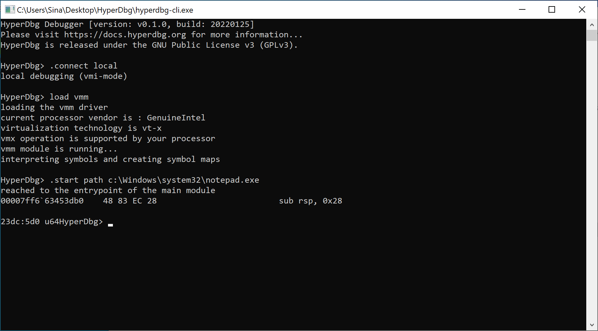
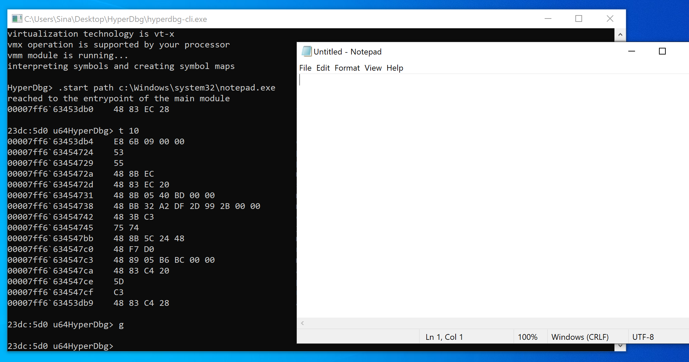
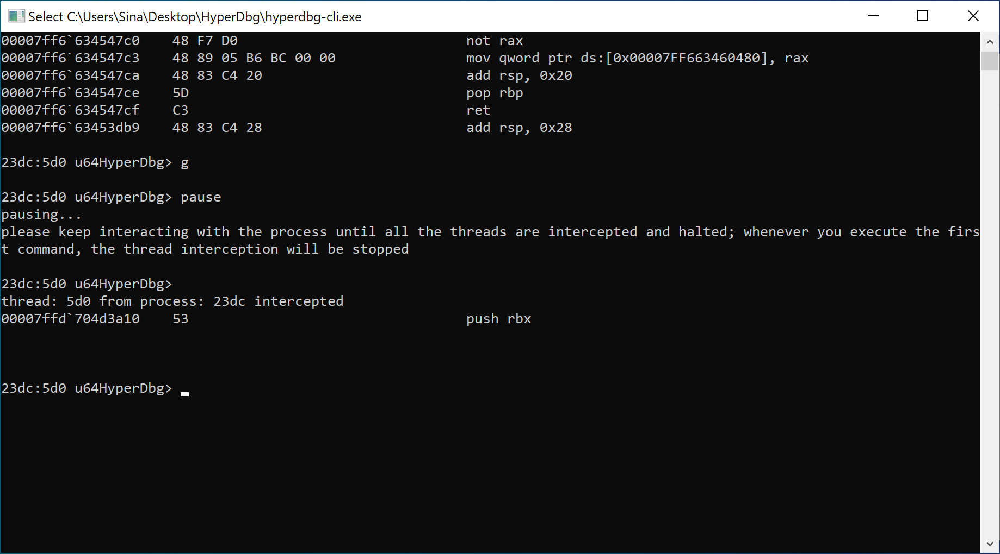
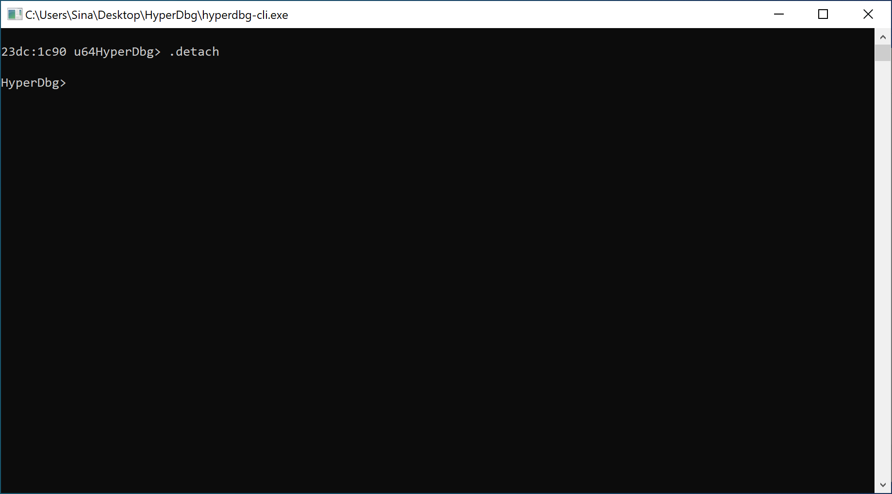

# Start a new process

Starting to debug a user-mode process from the start **entrypoint** of the module is one of the essential tasks that debuggers can do, and HyperDbg is no exception.

In HyperDbg, starting a process is possible in [VMI Mode](https://docs.hyperdbg.org/using-hyperdbg/prerequisites/operation-modes#vmi-mode) and [Debugger Mode](https://docs.hyperdbg.org/using-hyperdbg/prerequisites/operation-modes#debugger-mode).

HyperDbg won't use any Windows API for intercepting and pausing threads, and everything is done at the hypervisor level.


In contrast with the kernel debugger, the user debugger is still very basic and needs a lot of tests and improvements. We **highly recommend** not to run the user debugger in your bare metal system. Instead, run it on a [supported virtual machine](https://docs.hyperdbg.org/tips-and-tricks/nested-virtualization-environments/supported-virtual-machines) to won't end up with a Blue Screen of Death (BSOD) in your primary device. Please keep reporting the issues to improve the user debugger.


First, you need to either [connect to the local debugger](https://docs.hyperdbg.org/getting-started/attach-to-hyperdbg/local-debugging) or a [remote debugger over a serial port](https://docs.hyperdbg.org/getting-started/attach-to-hyperdbg/debug).

After that, you should use the "[.start](https://docs.hyperdbg.org/commands/meta-commands/.start)" command to run the process from the path in the target machine.

```
.start path c:\Windows\system32\notepad.exe
```

You can also specify the parameters of the target executable.

```
.start path c:\Windows\system32\notepad.exe c:\myfolder\myfile.txt
```

HyperDbg will run the process and put a breakpoint on the entrypoint of the process. Once the process reaches the entrypoint (loading module is finished), the debugger is paused again and gives the control back to the user or kernel debugger.



If you're using a kernel debugger, everything (including the operating system) is paused, and you can debug the process normally.

&#x20;If you're using the user debugger, the thread is halted and waits for the commands from the debugger.&#x20;

For example, we used the '[t](https://docs.hyperdbg.org/commands/debugging-commands/t)' command to step through the instructions.

After running the '[g](https://docs.hyperdbg.org/commands/debugging-commands/g)' command, the target process is continued normally.



If you want to pause the debuggee again, you can use the '[pause](https://docs.hyperdbg.org/commands/debugging-commands/pause)' command or press **CTRL+C**.

Note that pausing the target thread is only possible in user debugger, **not** kernel debugger.



At last, when we finished our debugging procedure, we can use the '[.detach](https://docs.hyperdbg.org/commands/meta-commands/.detach)' command to detach from the target process. Detaching from the process only makes sense in the user debugger.



In this article, we've learned how to start a process and halt at the entrypoint. You might want to attach to an already running process. For this purpose, please read [**here**](https://docs.hyperdbg.org/getting-started/attach-to-hyperdbg/attach-process).
