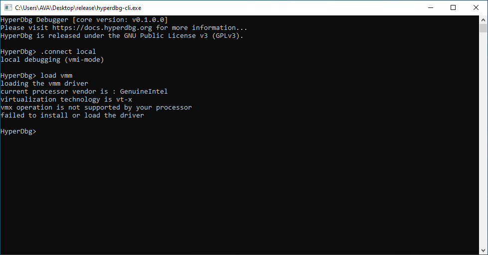
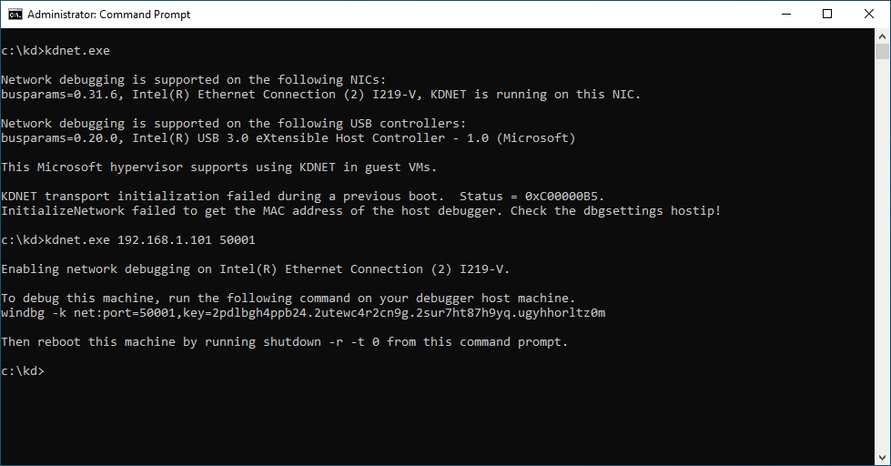
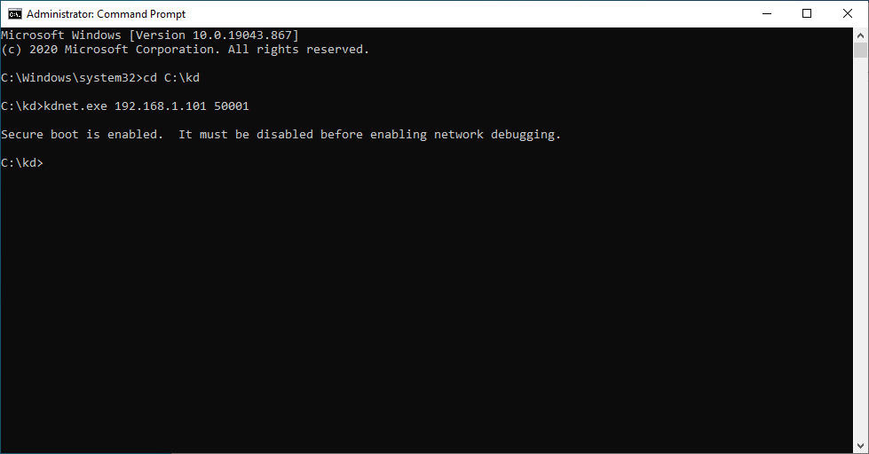
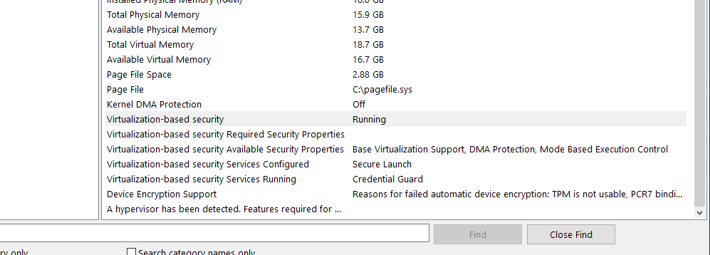
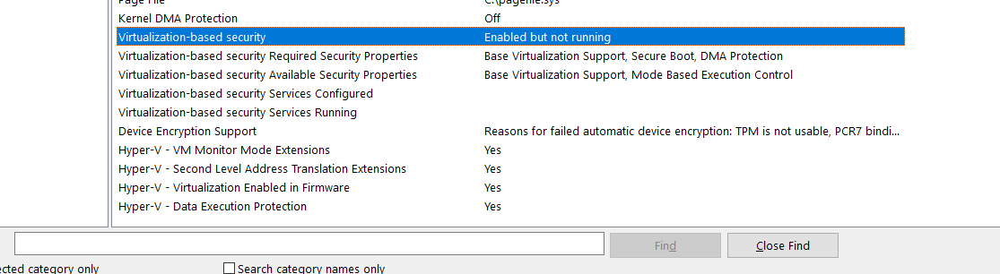
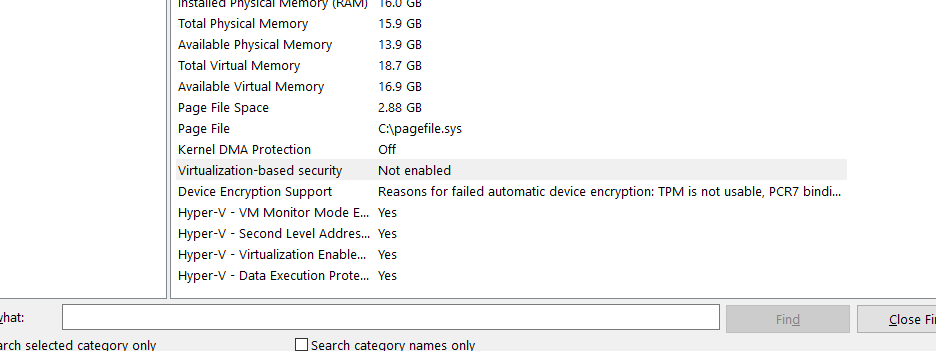
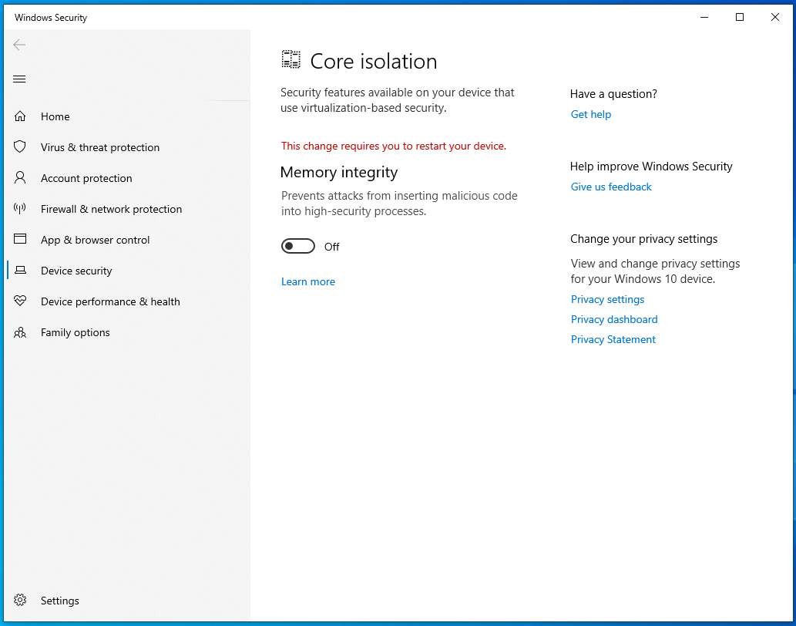
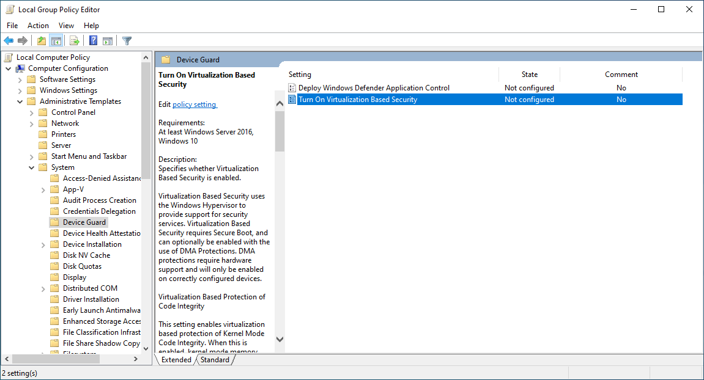
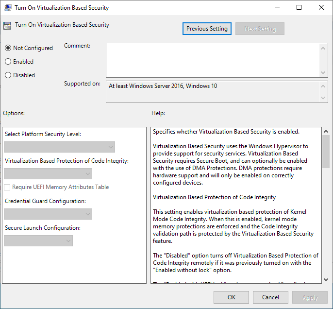

# Build & Install

## Download & Install

In order to use HyperDbg, you have two options. You can download the [**latest compiled binaries**](https://github.com/HyperDbg/HyperDbg/releases/latest), or manually download the source code and compile the binaries from the source code.

If you download compiled binary files, you can skip the **Build & Compile** section and move to the next section, otherwise, to **build** HyperDbg, you need to install the following software.

**Visual Studio Community, Enterprise, or Professional 2022 or later.**

* You can download it at: \[[https://www.visualstudio.com/downloads](https://www.visualstudio.com/downloads/)]

**Windows Software Development Kit (Windows SDK)**

* You can download it at: \[[https://developer.microsoft.com/en-us/windows/downloads/windows-sdk/](https://developer.microsoft.com/en-us/windows/downloads/windows-sdk/)]

**Windows Driver Kit (WDK)**

* You can download it at: \[[https://developer.microsoft.com/en-us/windows/hardware/windows-driver-kit](https://developer.microsoft.com/en-us/windows/hardware/windows-driver-kit)]


HyperDbg is currently compiled with the latest version of **SDK** and **WDK**. If you encounter any problems compiling with previous versions of **SDK**, or **WDK**, you have to update it before compiling HyperDbg.


### Build & Compile

First, clone the project using **git** or download precompiled binaries from [here](https://github.com/HyperDbg/HyperDbg/releases).

```
git clone --recursive https://github.com/HyperDbg/HyperDbg.git
```

Open the visual studio and **build** the solution.

After building, you need to disable driver signature enforcement. It is because the current versions of **HyperDbg** are not digitally signed.

For this purpose, you can **Disable Driver Signature Enforcement** or **Put Windows in Test Mode**.

## Running HyperDbg

Running HyperDbg has multiple stages. First, you should make sure to enable Intel **VT-x** from the BIOS. Next, you have to disable **Driver Signature Enforcement (DSE)** and turn off **Virtualization Based Security (VBS)**. Then you can run HyperDbg.

If you want to use HyperDbg on your own computer (**host**), for example for local kernel debugging, you need to disable **Driver Signature Enforcement (DSE**) on your local machine. Disabling DSE allows you to use HyperDbg on your own computer.

But if you want to debug a different computer (a **Guest Virtual Machine**), you don't need to disable any protections on your own computer (**host**). Instead, you only need to make the necessary changes on the guest machine itself. So you don't have to worry about disabling anything on your own computer when debugging a **guest** machine.

In short:

* Disable Driver Signature Enforcement on your own computer (**host**) if you want to run HyperDbg on it for local kernel debugging.
* When debugging a remote guest machine, make the required changes only on the guest machine, without disabling any protections on your own computer.

Remember, when attaching to a **guest** virtual machine, HyperDbg **does not** load any **drivers** or **hypervisors** on your **host** machine. Instead, it functions as a simple application that connects to the **guest** machine through the serial port and allows you to control it. In other words, HyperDbg acts as a simple bridge between your host machine and the target guest machine. It establishes a connection through the serial port without making any modifications or loading additional software on your host machine. Instead, the drivers and hypervisor will be loaded on the target guest machine.

On the rest of this page, you'll read a detailed explanation of performing the above stages.

### Check for VMX support

This check should be done in the **HOST** machine.

If you've ever run HyperDbg and encountered the below error, it means that **VT-x** is disabled from your BIOS.



Enabling **VT-x** from BIOS is vendor-specific. Usually, if you press \[**F2**], or \[**Delete**], or \[**ESC**] during the boot time, you'll enter the BIOS, and there should be an option to **Support Virtualization** or something like that. You should enable it from BIOS, and after that, you're good to go.

### Disable Driver Signature Enforcement

The next step is disabling **Driver Signature Enforcement (DSE)**.

HyperDbg's driver is **NOT** digitally signed.

In order to disable **driver signature enforcement**, we have plenty of options. However, we recommend the **first option**, which is **attaching WinDbg at the boot time**. It's because this way, PatchGuard will not start, and some of HyperDbg's commands like the '[!syscall](https://docs.hyperdbg.org/commands/extension-commands/syscall)' or the '[!sysret](https://docs.hyperdbg.org/commands/extension-commands/sysret)', which are PatchGuard detectable, will be usable.&#x20;

If you use other options, please keep in mind that you should be cautious as PatchGuard will start and detect some of the modifications and might be problematic.

Disabling **DSE** can be done in three ways (you have to choose one of them):

* Attaching WinDbg at the boot time (**Recommended**)
* Temporarily Disable DSE
* Putting Windows in Test Mode

#### Disable DSE by Attaching WinDbg

To debug a target Virtual Machine (VM), you need to perform actions on both the **guest** and the **host**. In other words, **WinDbg** is running on the host machine, and you're using it to connect and debug the guest machine. This allows you to analyze and troubleshoot issues within the target VM by using WinDbg (like regular kernel mode debugging by using WinDbg) and when WinDbg attaches to the target VM, it disables both the **Driver Signature Enforcement (DSE)** and if it's connected from the very first start of the Windows boot, it disables **PatchGuard** initialization.

HyperDbg won't import (or need) anything from WinDbg. We only need it to disable **DSE** and **PatchGuard**.

If you choose this option, you can use **kdnet.exe** from Windows SDK, please read [this documentation](https://learn.microsoft.com/en-us/windows-hardware/drivers/debugger/setting-up-a-network-debugging-connection-automatically) in order to understand how you can use **kdnet**. After that, performing the actions described [here](https://learn.microsoft.com/en-us/windows-hardware/drivers/debugger/setting-up-a-network-debugging-connection-automatically), you'll get a key that can be used on a remote machine to debug this machine using WinDbg, so, run the KDNET in your guest machine and get the keys and use the keys in the host machine.



When you load the HyperDbg's driver, you can close the **WinDbg**, and everything is handled in HyperDbg, and no need for WinDbg anymore. We want WinDbg to avoid starting PatchGuard and let us load our unsigned driver.

If your computer has the secure boot enabled, you'll see the following error.



You can disable secure boot from the BIOS. Most of the time, you should change the **secure boot** option to "**Other OSes**" that are not Windows.

That's it all. We're good to go to the next section.&#x20;

#### Temporarily Disable DSE

If you couldn't disable the DSE and PatchGuard by using the first option, you can perform this option. The following actions should be done in the **guest** if you want to debug a Virtual Machine (VM).

This is the simplest way to disable driver signature enforcement on Windows 10, and 11 but bear in mind that this method will temporarily disable driver signature enforcement.

After you restart, your computer driver signature enforcement will automatically turn itself on.

To disable driver signature enforcement, do the following:

1. Press and hold the **Shift** key on your keyboard and click the **Restart** button.
2. Choose to **Troubleshoot > Advanced options > Startup Settings** and click the **Restart** button.
3. When your computer restarts, you’ll see a list of options. Press **F7** on your keyboard to select **Disable driver signature enforcement**.
4. Your computer will now restart, and you’ll be able to install unsigned drivers.

Bear in mind that this method only temporarily disables driver signature enforcement, and after a restart, you have to re-disable it again.

#### Putting Windows in Test Mode

If you couldn't use the first two options, you could put the Windows in test mode. In test mode, you can install any drivers you want without experiencing any problems.

The following actions should be done in the **guest** if you want to debug a Virtual Machine (VM).

1. Open an elevated command prompt window on your PC: right-click on the Windows Start icon and select **Command prompt (Admin)**.
2. In cmd type:`bcdedit /set TESTSIGNING ON`
3. Close the cmd window and restart your computer.
4. Install your drivers.

For more options, please visit [here](https://windowsreport.com/driver-signature-enforcement-windows-10/).

### Disable VBS, HVCI, and Device Guard

The last step before running HyperDbg is disabling **Virtualization Based Security (VBS)**.

This step should be performed in the target debugging machine. If you want to debug a guest Virtual Machine (VM), then it should be performed on the **guest** side. If you want to use HyperDbg to perform local kernel debugging, then you should perform it on your target physical machine.

**HyperDbg** and **VBS** are both hypervisors running on ring -1. These hypervisors are not compatible, and you should disable VBS (and its sub-components like HVCI, Device Guard, etc.).

To check whether VBS is running on your system, type **System Information** on the start menu and click on the **System Information** app. After that, check whether the VBS is **running** or not like the below picture.&#x20;




If you see "**Enabled but not running**" or "**Not enabled**", you're good to go to the next step.

 

If the VBS is enabled, you can disable it by typing "**Core isolation**" on the start menu and turning off "**Memory integrity**".



The above step is enough to disable the VBS. After that, you should restart your computer so that VBS will be disabled on the next start.

If the above method didn't work for you, open **Local Group Policy Editor (gpedit.msc)** and navigate to the following path:

```
Local Computer Policy\Computer Configuration\Administrative Templates\System\Device Guard
```

Click on **Turn on Virtualization Based Security**.



Then choose the '**Disabled**' option and click '**OK**'.



After that, you should restart your computer and recheck **System Information** to see if it's still running or not.

There are also other options to disable **VBS** as described [here](https://beebom.com/how-disable-virtualization-based-security-vbs-windows-11/).

## Run & Test

Congratulations, you're ready to run HyperDbg.&#x20;

From now, you can either,

* [**Attach to a remote machine**](https://docs.hyperdbg.org/getting-started/attach-to-hyperdbg/debug)
* [**Attach to the local machine**](https://docs.hyperdbg.org/getting-started/attach-to-hyperdbg/local-debugging)

or visit [Quick Start](https://docs.hyperdbg.org/getting-started/quick-start) to start using **HyperDbg**.
