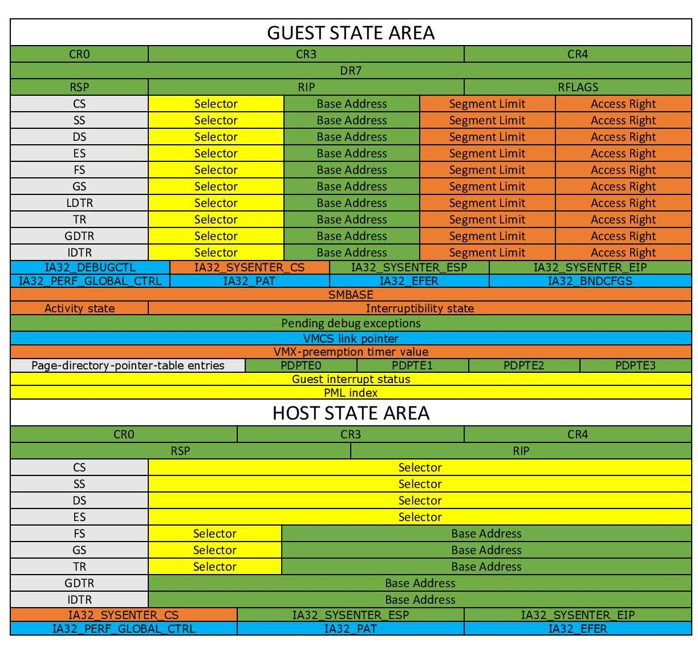
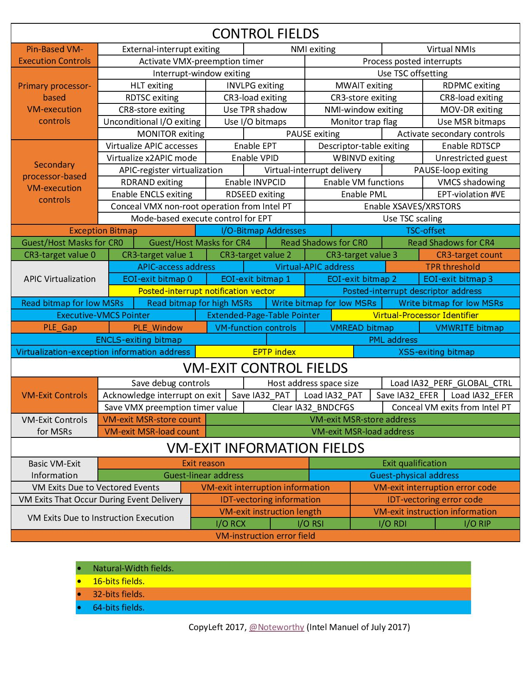
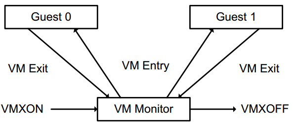

# Basic concepts in Intel VT-x

Some keywords will be frequently used in HyperDbg, and you should know about them (Most of the definitions derived from **Intel software developer’s manual, volume 3C**).

**Virtual Machine Monitor (VMM)**: VMM acts as a host and has full control of the processor(s) and other platform hardware. A VMM is able to retain selective control of processor resources, physical memory, interrupt management, and I/O.

**Guest Software**: Each virtual machine (VM) is a guest software environment.

**VMX Root Operation and VMX Non-root Operation**: A VMM will run in VMX root operation, and guest software will run in VMX non-root operation.

**VMX transitions**: Transitions between VMX root operation and VMX non-root operation.

**VM entries**: Transitions into VMX non-root operation.

**Extended Page Table (EPT)**: A modern mechanism that uses a second layer to convert the guest's physical address to the host's physical address.

**VM-exits**: Transitions from VMX non-root operation to VMX root operation.

**Virtual machine control structure (VMCS)**: is a data structure in memory that exists exactly once per VM (or more precisely one per each VCPU \[Virtual CPU]), while the VMM manages it. With every change of the execution context between different VMs, the VMCS is restored for the current VM, defining the state of the VM’s virtual processor and VMM control Guest software using VMCS.

The VMCS consists of six logical groups:

* Guest-state area: Processor state saved into the guest state area on VM exits and loaded on VM entries.
* Host-state area: Processor state loaded from the host state area on VM exits.
* VM-execution control fields: Fields controlling processor operation in VMX non-root operation.
* VM-exit control fields: Fields that control VM exits.
* VM-entry control fields: Fields that control VM entries.
* VM-exit information fields: Read-only fields to receive information on VM exits describing the cause and the nature of the VM exit.

I found a great work that illustrates the VMCS.

The PDF version is also available [here](https://rayanfam.com/wp-content/uploads/sites/2/2018/08/VMCS.pdf).

### **VMX Instructions**

VMX introduces the following new instructions.

| Intel/AMD Mnemonic | Description                                        |
| ------------------ | -------------------------------------------------- |
| INVEPT             | Invalidate Translations Derived from EPT           |
| INVVPID            | Invalidate Translations Based on VPID              |
| VMCALL             | Call to VM Monitor                                 |
| VMCLEAR            | Clear Virtual-Machine Control Structure            |
| VMFUNC             | Invoke VM function                                 |
| VMLAUNCH           | Launch Virtual Machine                             |
| VMRESUME           | Resume Virtual Machine                             |
| VMPTRLD            | Load Pointer to Virtual-Machine Control Structure  |
| VMPTRST            | Store Pointer to Virtual-Machine Control Structure |
| VMREAD             | Read Field from Virtual-Machine Control Structure  |
| VMWRITE            | Write Field to Virtual-Machine Control Structure   |
| VMXOFF             | Leave VMX Operation                                |
| VMXON              | Enter VMX Operation                                |

#### **Life Cycle of VMM Software**

* The following items summarize the life cycle of a VMM and its guest software, as well as the interactions between them:
  * Software enters VMX operation by executing a VMXON instruction.
  * Using VM entries, a VMM can then turn guests into VMs (one at a time). The VMM effects a VM entry using instructions VMLAUNCH and VMRESUME; it regains control using VM exits.
  * VM exits transfer control to an entry point specified by the VMM. The VMM can take action appropriate to the cause of the VM exit and can then return to the VM using a VM entry.
  * Eventually, the VMM may decide to shut itself down and leave VMX operation. It does so by executing the VMXOFF instruction.
