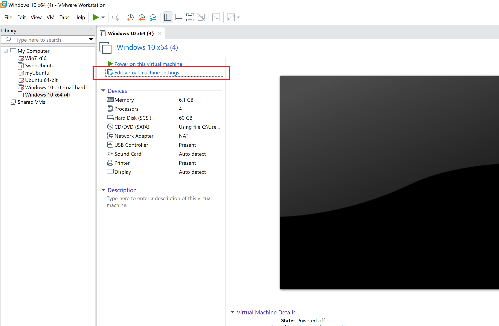
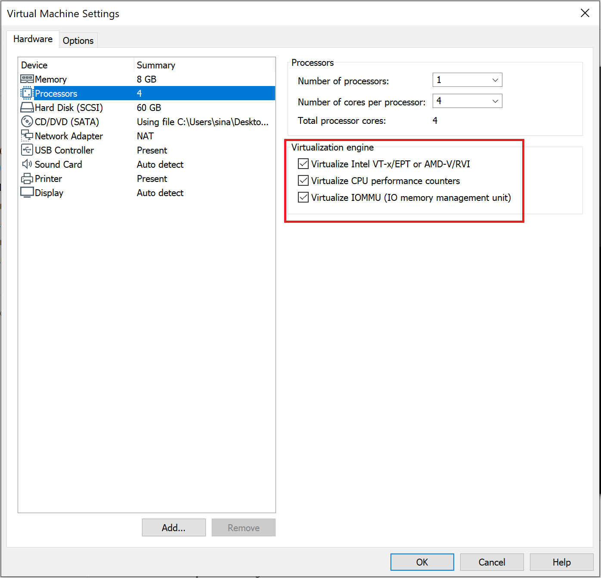

# Run HyperDbg on VMware

If you want to attach to HyperDbg in the [debugger mode](https://docs.hyperdbg.org/using-hyperdbg/prerequisites/operation-modes#debugger-mode) or if you want to attach [two VMs together](https://docs.hyperdbg.org/getting-started/attach-to-hyperdbg/debug#vmware-workstation-two-vms), please follow the steps provided [here](https://docs.hyperdbg.org/getting-started/attach-to-hyperdbg/debug#vmware-workstation).

In order to run HyperDbg on VMware, you should enable nested-virtualization on it.

First of all, make sure to update your VMWare to the latest version (it’s important as VMWare sometimes has problems with nested-virtualization on out-dated versions).

Click on "Edit virtual machine settings" on your target VM.

Now, enable the following options on your machine.

Note that you have a limitation on using **!ioin** and **!ioout** in VMware nested-virtualization. ([VMware backdoor I/O port](https://docs.hyperdbg.org/tips-and-tricks/nested-virtualization-environments/vmware-backdoor-io-ports)).


**HyperDbg** will not hide traces from VMware or any other nested-virtualization environments. Malware or any application can detect the presence of VMWare, and regular anti-vm techniques detect the VMware environment.

