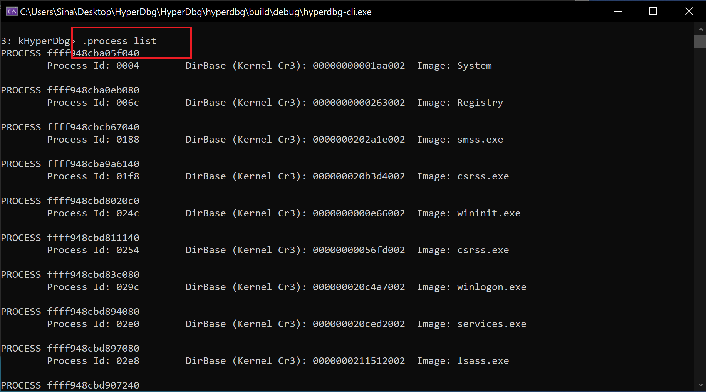
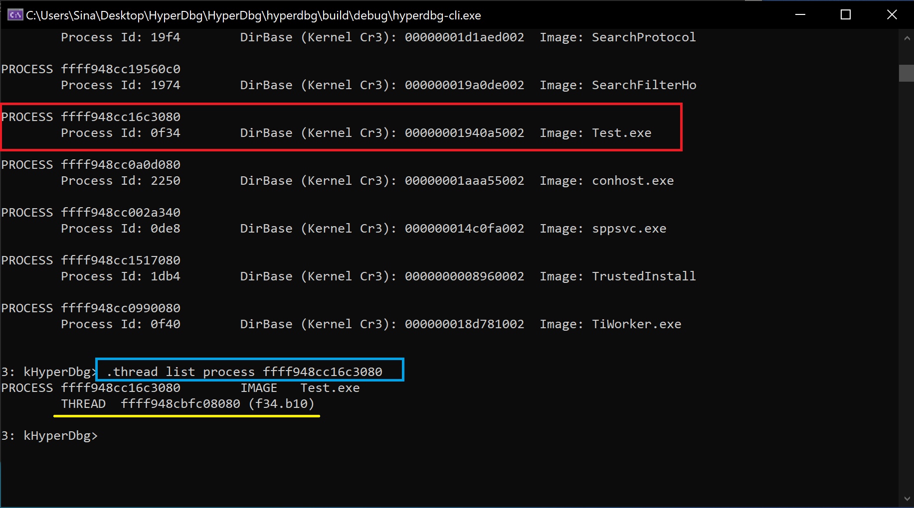
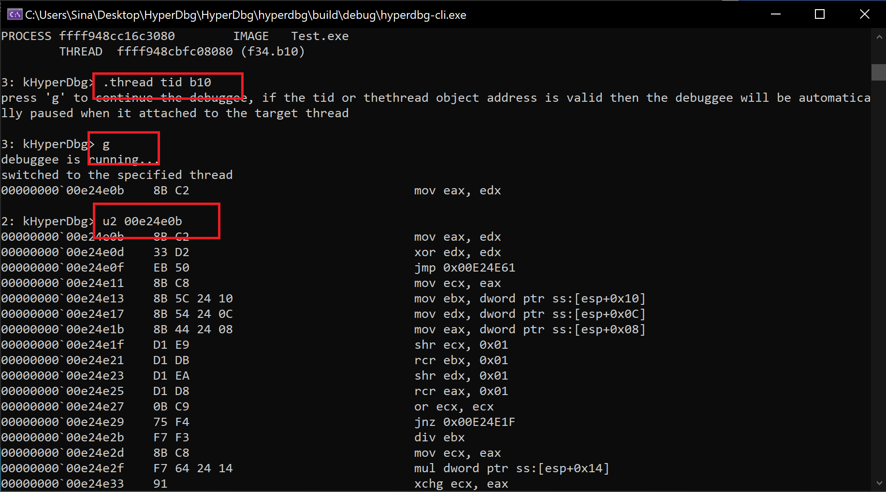
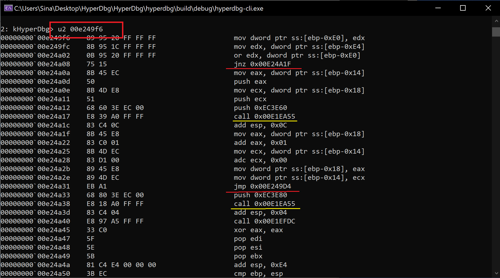
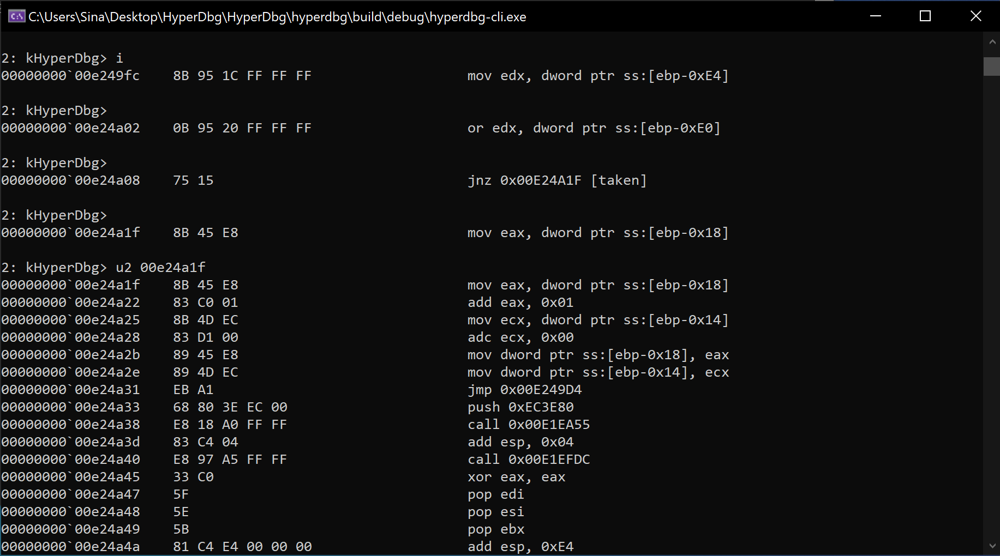
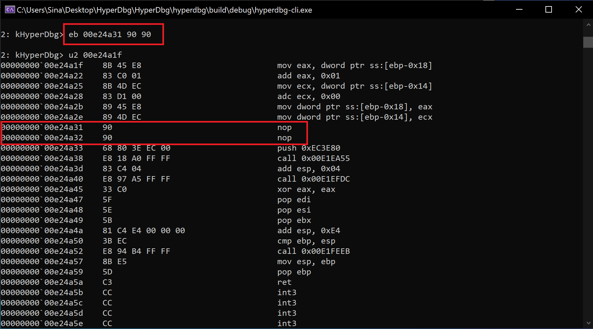
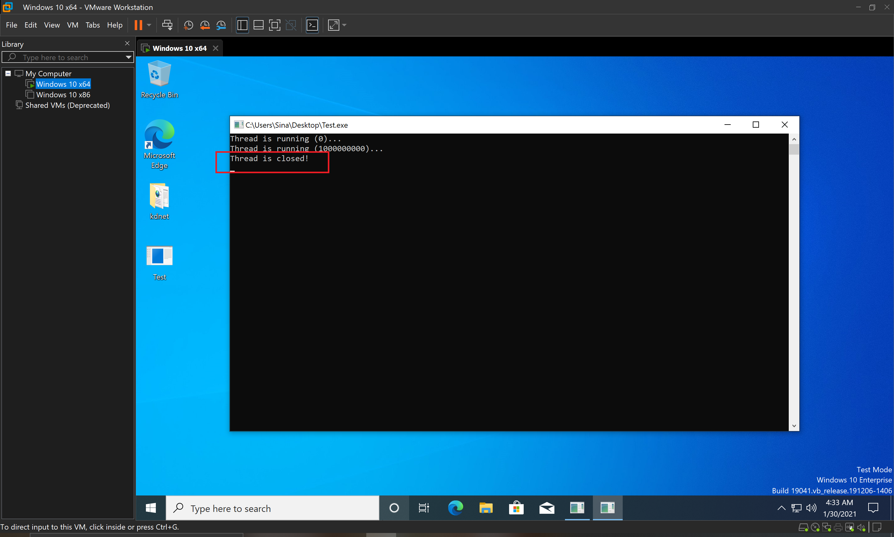

# Switching to a Specific Process or Thread

Switching to new processes/threads is useful when debugging a particular process or a user-mode application. These switchings are possible through the '[.process](https://docs.hyperdbg.org/commands/meta-commands/.process)' and '[.thread](https://docs.hyperdbg.org/commands/meta-commands/.thread)' commands.

In HyperDbg, there are different implementations of these switchings. You can read more about these differences [here](https://docs.hyperdbg.org/tips-and-tricks/considerations/difference-between-process-and-thread-switching-commands).

In this example, we walk through a C code to show how to use these commands.

Imagine we compiled the following program. It's an infinite loop that prints a counter every **1000000000** times.

```clike
#include <Windows.h>
#include <conio.h>
#include <iostream>

int main() {

	bool Test = true;
	UINT64 Counter = 0;

	while (Test) {

		if (Counter % 1000000000 == 0) {
			printf("Thread is running (%lld)...\n", Counter);
		}
		Counter++;
	}

	printf("Thread is closed!\n");
	_getch();
}
```

After compiling and running the above code, we use the command shown in the picture to view the list of processes and other information about the processes running in the system.



We find our target program which its name is "**Test.exe**". Then, we see a list of running threads based on this process. For this purpose, we used the process object address (`nt!_EPROCESS`).



Now, we can switch to the target thread and continue the debuggee. Whenever the system reaches the target thread, it will be halted again and run new commands.

Note that it's a 32-bit program, so we use the '[u2](https://docs.hyperdbg.org/commands/debugging-commands/u)', which is the 32-bit version of the disassembler in this case.



After analyzing the program, we find the in the assembly code. You can also see the calls that are probably a link to the `printf` function.



Then, we step through the instructions to better understand how this program works.



After some investigation, we can conclude that the guilty if is located at `0xe24a31`, so we'll modify the memory and patch it by using nops (0x90).



If we continue the debuggee again, you can see that the patched program jumps out of the infinite loop and show the 'thread is closed!' message.



It was a simple example of how to use thread and process switching commands in HyperDbg. You can think about different approaches that you can use to change the program's execution flow (like changing the RFLAGS) or analyze any other programs.
