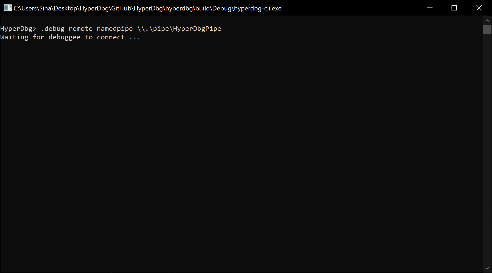
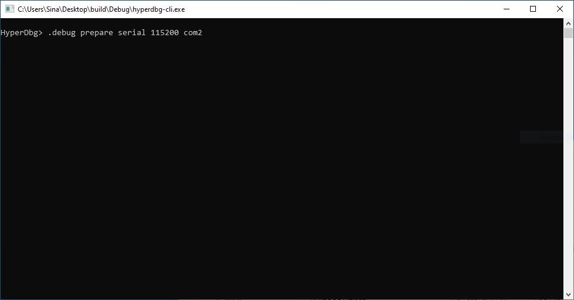
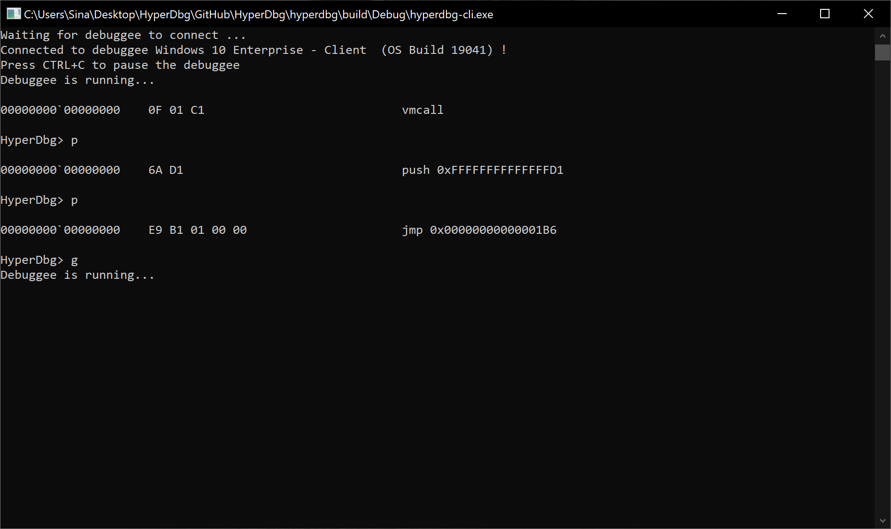
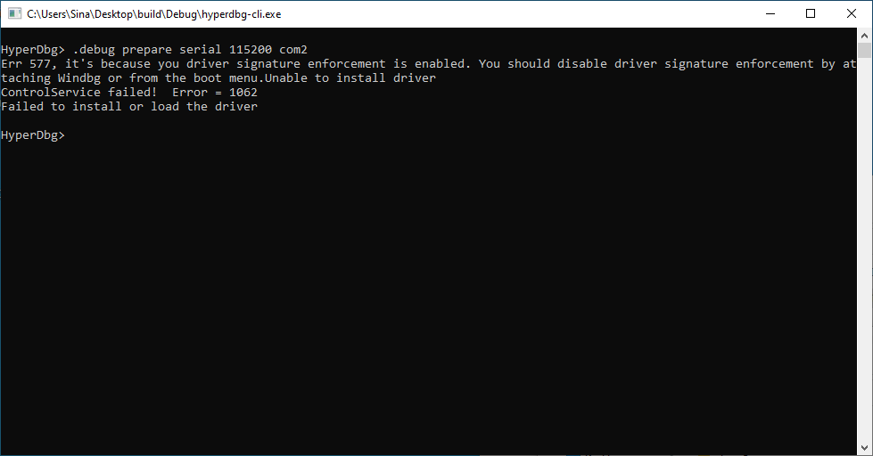

# Connecting To HyperDbg

This article only describes the **Debugger Mode** of the HyperDbg in the VMware workstation and **cannot** be applied to the VMware player.

You might want to :

* [Attach to a local machine](https://docs.hyperdbg.com/getting-started/attach-to-hyperdbg/attach-to-local-machine)
* [Connect to a physical machine](https://docs.hyperdbg.com/getting-started/attach-to-hyperdbg/debug#physical-machine)
* [Connect to VMI Mode](https://docs.hyperdbg.com/getting-started/attach-to-hyperdbg/debug#connect-to-debuggee-vmi-mode)

In order to run HyperDbg on a VMware Workstation machine, first, turn off your guest machine then, you need to enable **Nested Virtualization**. Open your virtual machine and click on Edit **virtual machine settings**.

VMware Player doesn't have nested virtualization, so it cannot be used for HyperDbg debugging.


After that, click on **Virtualize Intel VT-x/EPT or AMD-V/RVI** and **Virtualize IOMMU \(IO memory management unit\)**.


Next, click on **Add...** then choose **Serial Port** and click on **Finish**.


Now, click on **Use named pipe:** and add a name for your named pipe. 

Your name should start with **`\\.\pipe\`** . For example, choose **`\\.\pipe\HyperDbgDebug`**.

Make sure to enable **Yield CPU on poll**.


Now it's time to create a kernel debug connection. First of all, run the following command on the host \(debugger\). You should change the named pipe address to whatever name you chose on the previous part.   

```text
HyperDbg> .debug remote namedpipe \\.\pipe\HyperDbgPipe
```



After you tell the debugger to listen on a COM port or a named pipe, now you can run the following command in the debuggee \(guest\).

```text
HyperDbg> .debug prepare serial 115200 com2
```



Most of the times, if the serial port is the only serial device that you add to the virtual machine, then the name of the connected port is `com2`. However, you can see the exact name of the COM port on the guest's device manager.

After running the above command in guest, now you should see that the debuggee is connected to the debugger.


If you see an error for driver signature enforcement, please visit [here](https://docs.hyperdbg.com/using-hyperdbg/examples/connecting-to-hyperdbg#driver-signature-enforcement-error).


You can press CTRL+C to pause the debuggee and step through the kernel codes using the ['p' command](https://docs.hyperdbg.com/commands/debugging-commands/p) and the ['t' command](https://docs.hyperdbg.com/commands/debugging-commands/t), and if you want to continue the normal execution of the debuggee, you can use the ['g' command](https://docs.hyperdbg.com/commands/debugging-commands/g).



### Driver Signature Enforcement Error

If you are using an unsigned version of HyperDbg driver, you should turn off the **Driver Signature Enforcement**.



For disabling Driver Signature Enforcement, you can visit [here](https://docs.hyperdbg.com/getting-started/build-and-install#disable-driver-signature-enforcement).

