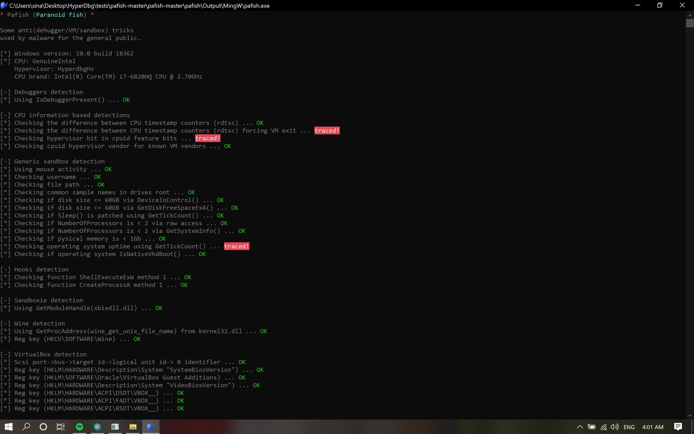
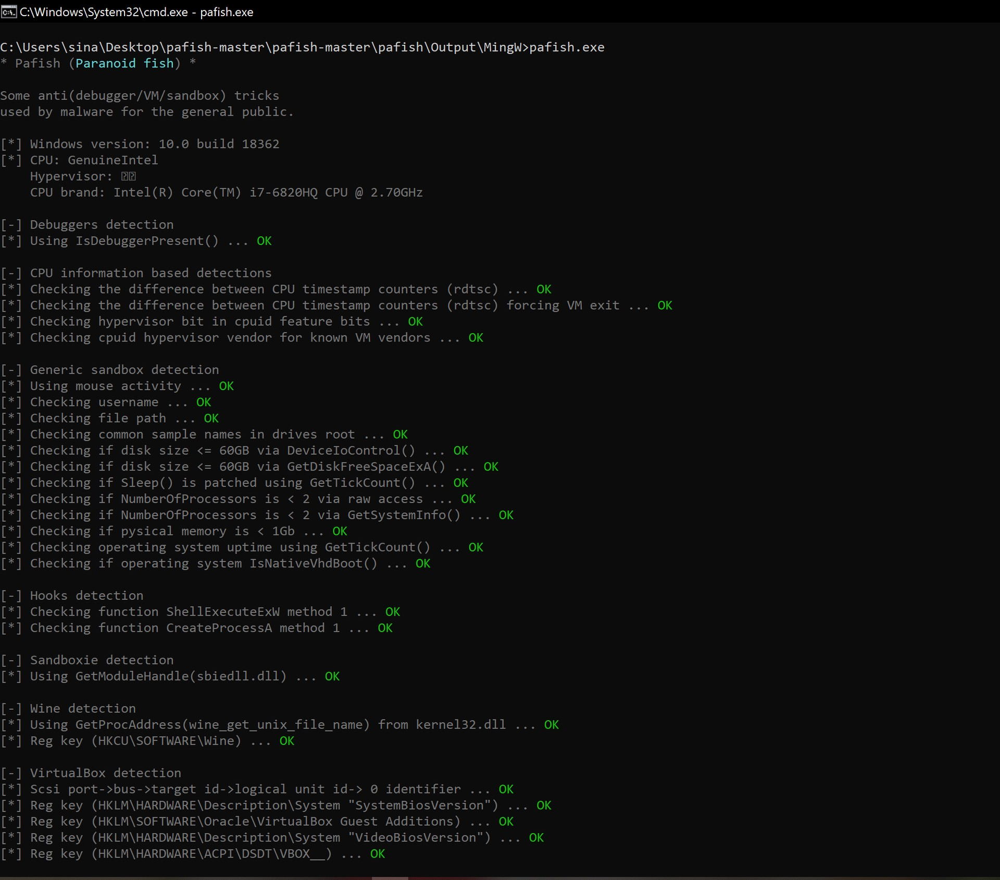

# Defeating Anti-Debug & Anti-Hypervisor Methods

**Transparent-mode** is an **anti-anti-debugging** and an **anti-anti-hypervisor** solution for HyperDbg.

If you enable this mode, then HyperDbg tries to make itself transparent from anti-debugging and anti-hypervisor methods and not reveal the hypervisor's presence on timing and microarchitectural attacks; however, it won't guarantee 100% transparency, but it makes it substantially harder for the anti-debugging methods.

To enable this mode, you should use '[!measure](https://docs.hyperdbg.org/commands/extension-commands/measure)' and '[!hide](https://docs.hyperdbg.org/commands/extension-commands/hide)' commands.

You can use **Transparent Mode** in both **VMI Mode** and **Debugger Mode**.

For testing transparent-mode, we use [pafish](https://github.com/a0rtega/pafish).

**Pafish** is a demonstration tool that employs several techniques to detect sandboxes and analysis environments in the same way as malware families do. 

If we load HyperDbg and run **pafish**, we see the following results:



As you can see in the above picture, HyperDbg is detected by many factors. In fact, **pafish** checks for the hypervisor's presence, and as HyperDbg uses a hypervisor, then it shows that a debugger is present or the environment is not safe for malware to run.

Now, we can use HyperDbg's Transparent-mode to bypass **pafish**.

For enabling this mode, first, we should use the '[!measure](https://docs.hyperdbg.org/commands/extension-commands/measure)' command. This command uses statistical methods to measure and provide the details for the transparent-mode of HyperDbg for defeating anti-debugging and anti-hypervisor methods.

This command should be run before we '[load](https://docs.hyperdbg.org/commands/debugging-commands/load)' the debugger or before connecting to the debugger, and after that, we can use the '[!hide](https://docs.hyperdbg.org/commands/extension-commands/hide)' command.

```text
HyperDbg> !measure
```

If we want to use the hardcoded results and statistics for a not-running hypervisor machine, we can use the following command to apply the default measurements.

```text
HyperDbg> !measure default
```

After that, we should use the '[!hide](https://docs.hyperdbg.org/commands/extension-commands/hide)' command. For example, if you want to apply the transparent features to process id `2a78` we can use the following command.

```text
HyperDbg> !hide pid 2a78
```

Most of the times, applications check for anti-debug methods on their very first execution stages; thus, it's not simply possible to use `!hide` with `pid`. To solve this problem, we can use the `name` of the process.

We want to apply to the **pafish** process name. `pafish.exe` is the name of this process. The following command is used :

```text
HyperDbg> !hide name pafish.exe
```

If we recheck the result of the **pafish** again, we see the following results.



Transparent-mode is under active development, and on each version, we add new methods to this mode to make sure that HyperDbg is transparent. However, this mode still needs a lot of contributions.

If you think you can add new methods for transparency, don't forget to contribute or ping us on [GitHub](https://github.com/HyperDbg/HyperDbg).

