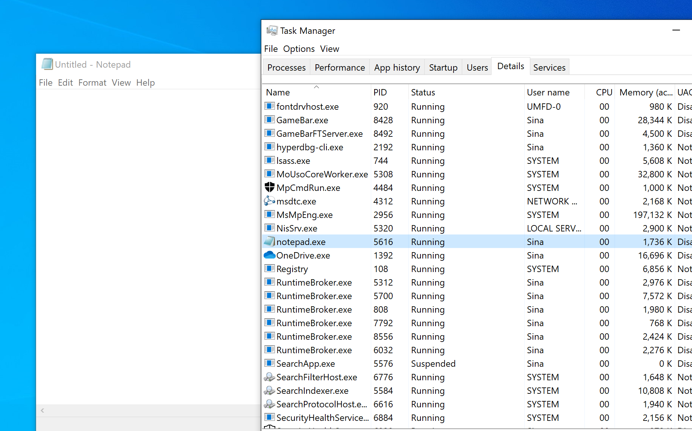
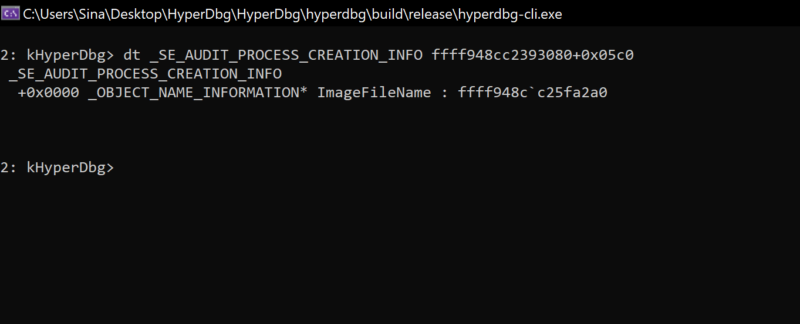
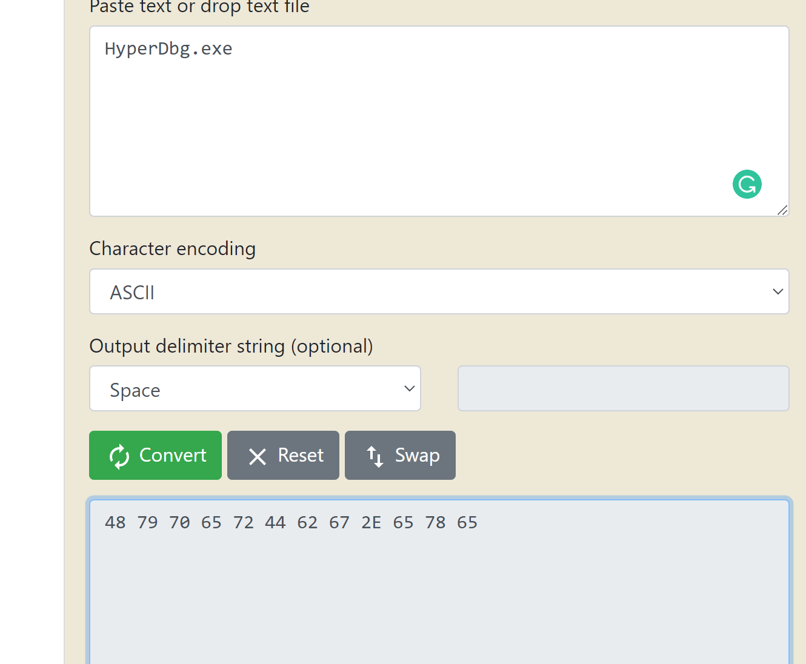
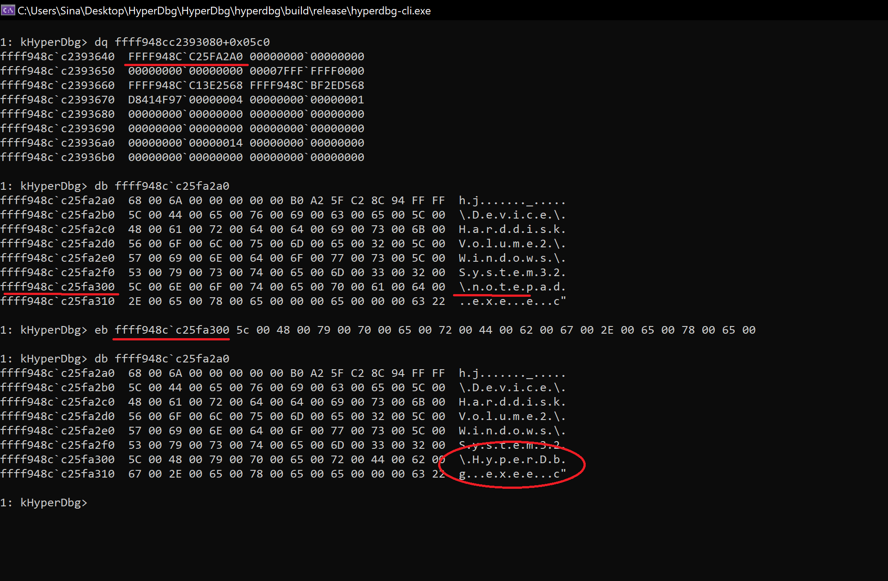
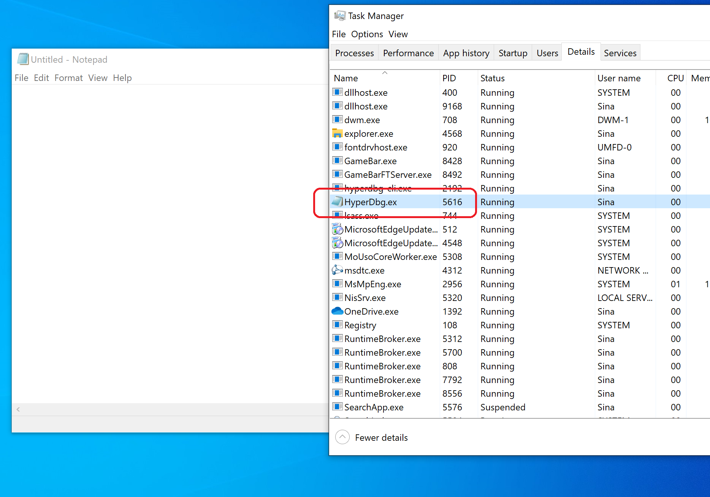

# Mapping Data & Create Structures, and Enums From Symbols

```clike
HyperDbg> struct _SE_AUDIT_PROCESS_CREATION_INFO
typedef struct _SE_AUDIT_PROCESS_CREATION_INFO
{
  /* 0x0000 */ struct _OBJECT_NAME_INFORMATION* ImageFileName;
} SE_AUDIT_PROCESS_CREATION_INFO, *PSE_AUDIT_PROCESS_CREATION_INFO; /* size: 0x0008 */


HyperDbg> struct _OBJECT_NAME_INFORMATION
typedef struct _OBJECT_NAME_INFORMATION
{
  /* 0x0000 */ struct _UNICODE_STRING Name;
} OBJECT_NAME_INFORMATION, *POBJECT_NAME_INFORMATION; /* size: 0x0010 */


HyperDbg> struct _UNICODE_STRING
typedef struct _UNICODE_STRING
{
  /* 0x0000 */ uint16_t Length;
  /* 0x0002 */ uint16_t MaximumLength;
  /* 0x0004 */ long Padding_0;
  /* 0x0008 */ wchar_t* Buffer;
} UNICODE_STRING, *PUNICODE_STRING; /* size: 0x0010 */
```

```clike
1: kHyperDbg> .format 0n5616
evaluate expression:
Hex :        00000000`000015f0
Decimal :    5616
Octal :      12760
Binary :     00000000 00000000 00000000 00000000 00000000 00000000 00010101 11110000
Char :       ........
Time :       04/19/22 - 12:53AM
Float :      0.00 +3e-320 2.774673E-320
Double :     2.77467266704444059e-320
```

```clike
1: kHyperDbg> .process list

...

PROCESS ffff948cc1517080
        Process Id: 23d0        DirBase (Kernel Cr3): 00000000127c0002  Image: dllhost.exe

PROCESS ffff948cc2393080
        Process Id: 15f0        DirBase (Kernel Cr3): 0000000190649002  Image: notepad.exe

PROCESS ffff948cc06f6080
        Process Id: 0fc4        DirBase (Kernel Cr3): 000000002902c002  Image: Taskmgr.exe
...
```

```clike
1: kHyperDbg> dt nt!_EPROCESS ffff948cc2393080
 _EPROCESS

...

  +0x05b7 uint8_t PriorityClass : 0x2
  +0x05b8 void* SecurityPort : (null)
  +0x05c0 _SE_AUDIT_PROCESS_CREATION_INFO SeAuditProcessCreationInfo : ffff948c`c25fa2a0
  +0x05c8 _LIST_ENTRY JobLinks : _LIST_ENTRY [ 00000000`00000000 - 00000000`00000000 ]
...
```










