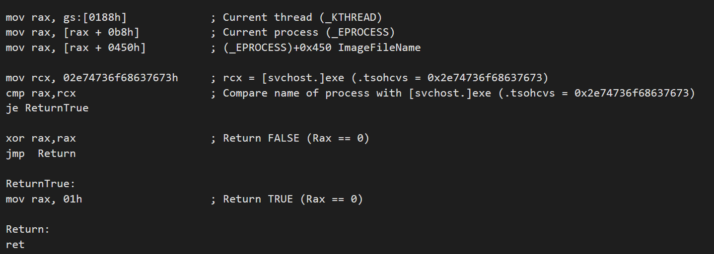

# How to create a condition?

HyperDbg supports to create conditional events, each event has one [condition ](https://docs.hyperdbg.com/design/debugger-internals/conditions)and can have multiple [actions](https://docs.hyperdbg.com/design/debugger-internals/actions).

An unconditional event is an event that all its actions will be executed without any condition.

This document is a brief of how to create a conditional event.

Each command in HyperDbg that we call it an "event", follows the same structure described [here](https://docs.hyperdbg.com/design/debugger-internals/events). At the time you execute a command, you can add a `condition { xx xx xx xx }` where `xx` is the assembly \(hex\) of what you want to be executed in the case of that event.

For example, let's imagine we want to create a condition for a command like "**!epthook**".

When you execute the command like :

```c
!epthook fffff801deadbeef 
```

then it is unconditional but when you execute a command like this :

```c
!epthook fffff801deadbeef condition { 90 90 90 90 }
```

then it is a conditional command.


Note that you can use all of the events in the same way \(instead of **!epthook**\), for example, you can use **!syscall, !sysret, !epthook2, !ioin** and etc.


### Example 1

Imagine we want to check for the name of the process and only and only if the name contains the "svchost.exe" then trigger the event's action\(s\).

We all know that you can search for the name of the process in its `_EPROCESS`.


For example, **ImageFileName** in **\_EPROCESS** contains the 15 characters of the process name. It is not where Windows shows the name in Task Manager but checking this value is enough.

Imagine the following assembly code that gets the current `_KTHREAD` from `_KPCR`. From there we can find the address of `_KPROCESS` and this structure is located at the start address of `_EPROCESS`. 

As you can see from the above picture, **ImageFileName** is located at `+0x450` after the `_EPROCESS`.

So our final assembly code is like this : 




The offsets of EPROCESS and other structures might change in the different versions of Windows. 


Now we should assemble the above code into its hex representation in the assembly. For example, you can use an [online assembler](http://defuse.ca/online-x86-assembler.htm). 

Keep in mind that if you return with `rax=0` or `null` then it means **false** and if your return anything other than zero \(for example `rax=1`\) then it means **true**.

If you return true then all the actions of that event will be executed and if you return **false**, then HyperDbg ignores the actions of that event.

The final result of the assembler is :

```c
0:  65 48 8b 04 25 88 01    mov    rax,QWORD PTR gs:0x188
7:  00 00
9:  48 8b 80 b8 00 00 00    mov    rax,QWORD PTR [rax+0xb8]
10: 48 8b 80 50 04 00 00    mov    rax,QWORD PTR [rax+0x450]
17: 48 b9 73 76 63 68 6f    movabs rcx,0x2e74736f68637673
1e: 73 74 2e
21: 48 39 c8                cmp    rax,rcx
24: 74 05                   je     2b <ReturnTrue>
26: 48 31 c0                xor    rax,rax
29: eb 07                   jmp    32 <Return>
000000000000002b <ReturnTrue>:
2b: 48 c7 c0 01 00 00 00    mov    rax,0x1
0000000000000032 <Return>:
32: c3                      ret
```

Now you can call the command with the following arguments :

```c
!epthook fffff801deadbeef condition {65488B042588010000488B80B8000000488B805004000048B9737663686F73742E4839C874054831C0EB0748C7C001000000C3}
```

or

```c
!syscall condition {65488B042588010000488B80B8000000488B805004000048B9737663686F73742E4839C874054831C0EB0748C7C001000000C3}
```

We automatically add a `0xc3` or `ret` opcode to the end of the condition assembly and in the case if you forget to return the control of the processor back to the HyperDbg, then there is no problem. Make sure to not jump to another address without returning back to the HyperDbg, otherwise it causes a crash on your system.

### Example 2

Sometimes we need to read the registers and decide based on them, for example, let's imagine we want to hook `ExAllocatePoolWithTag` and if the size of the requested buffer is `xx` then perform the actions.

This function is defined is like this :

```cpp
PVOID ExAllocatePoolWithTag(
  POOL_TYPE                                      PoolType,
  SIZE_T                                         NumberOfBytes,
  ULONG                                          Tag
);
```

It's obvious that based on x64 fastcall calling convention in Windows, `PoolType` is on `rcx`, `NumberOfBytes` is on `rdx` and `Tag` is on `r8`. We need to check for `rdx`.

Note that `rdx` is not the same as the `rdx` that you receive in the function, instead we pass a structure that contains all the general-purpose register, you can read them or even modify them and if you modify them then the operating system will continue with new values in these registers.

For general-purpose registers, we pass a pointer to the following structure as the first argument on `rcx`. 

```cpp
typedef struct _GUEST_REGS
{
    ULONG64 rax; // 0x00
    ULONG64 rcx; // 0x08
    ULONG64 rdx; // 0x10
    ULONG64 rbx; // 0x18
    ULONG64 rsp; // 0x20 
    ULONG64 rbp; // 0x28
    ULONG64 rsi; // 0x30
    ULONG64 rdi; // 0x38
    ULONG64 r8;  // 0x40
    ULONG64 r9;  // 0x48
    ULONG64 r10; // 0x50
    ULONG64 r11; // 0x58
    ULONG64 r12; // 0x60
    ULONG64 r13; // 0x68
    ULONG64 r14; // 0x70
    ULONG64 r15; // 0x78
} GUEST_REGS, *PGUEST_REGS;
```


If you want to change or examine other registers like XMM registers, floating-point registers, or other registers, you can change and examine them directly.


In the following example, we want to check `NumberOfBytes (rdx)` with `0x1000` and if the requested size is **0x1000** then the actions should be performed.

```cpp
mov rbx , [rcx+0x10]  ; rbx now conains the rdx of the guest [target debuggee]
cmp rbx, 0x1000       ; compare rbx with 0x1000
je ReturnTrue

xor rax,rax
jmp Return

ReturnTrue :
mov rax, 0x1

Return:
ret
```

After using assembler to convert the above code to hex representation of assembly, the final command will be like this : 

```cpp
!epthook2 fffff800`4ed6f010 condition {488B59104881FB0010000074054831C0EB0748C7C001000000C3}
```

One important note is that if you want to create a condition for **!syscall** command which is common, then you should know that syscall calling convention is fastcall \(`rcx`, `rdx`, `r8`, `r9` and stack\), so if your target user-mode application is x64 then you can expect the exact arguments from user-mode to kernel-mode but if your user-mode application is x86 then Windows might change some of the arguments that contain addresses to new addresses. 

