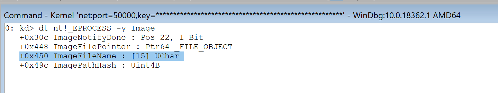

# How to create an action?

[Actions ](https://docs.hyperdbg.com/design/debugger-internals/actions)are the most essential part of the [events](https://docs.hyperdbg.com/design/debugger-internals/events).

Each event consists of zero or multiple actions. An event with zero actions is treated as a disabled event.

There are three types of actions in HyperDbg as described [here](https://docs.hyperdbg.com/using-hyperdbg/prerequisites).

You can have multiple "**run custom codes**", "**log the states**", and "**break to the debugger**".

This document is a brief of how to create actions for an event.

### Break to the debugger

Break to the debugger, works exactly like classic debuggers like Windbg.

If you simply use a command without any extra parameters then it will be treated like classic debuggers and HyperDbg gives the control of the system to the debugger.

### Log the states 

### Run custom codes

**Run custom code** gives you the ability to run your custom assembly codes whenever a special event is triggered; this option is fast and powerful as you can customize the HyperDbg based on your needs.


Accessing random memory in **custom code** and **condition code** is considered "[unsafe](https://docs.hyperdbg.com/tips-and-tricks/considerations/the-unsafe-behavior)". You have some limitations on accessing memory on some special events.


#### Run custom code without a safe buffer

Each command in HyperDbg that are tagged as "**event**" in the documentation, follows the same structure described [here](https://docs.hyperdbg.com/design/debugger-internals/events). At the time you execute a command, you can add a `code { xx xx xx xx }` where `xx` is the assembly \(hex\) of what you want to be executed in the case of that event.

Generally, the assembly `code` in the code block will be called in the following form.

```c
typedef PVOID
DebuggerRunCustomCodeFunc(PVOID PreAllocatedBufferAddress, PGUEST_REGS Regs, PVOID Context);
```

As it called in the fastcall calling convention, **PreAllocatedBufferAddress** will be on `rcx`, **Regs** will be on `rdx` and **Context** is on `r8`.

**PreAllocatedBufferAddress** is the address of a non-paged safe buffer which is passed to the function on `rcx`. \(more about it later\).

**Regs**, for general-purpose registers, we pass a pointer to the following structure as the second argument on `rdx`. 

```cpp
typedef struct _GUEST_REGS
{
    ULONG64 rax; // 0x00
    ULONG64 rcx; // 0x08
    ULONG64 rdx; // 0x10
    ULONG64 rbx; // 0x18
    ULONG64 rsp; // 0x20 
    ULONG64 rbp; // 0x28
    ULONG64 rsi; // 0x30
    ULONG64 rdi; // 0x38
    ULONG64 r8;  // 0x40
    ULONG64 r9;  // 0x48
    ULONG64 r10; // 0x50
    ULONG64 r11; // 0x58
    ULONG64 r12; // 0x60
    ULONG64 r13; // 0x68
    ULONG64 r14; // 0x70
    ULONG64 r15; // 0x78
} GUEST_REGS, *PGUEST_REGS;
```

The **Context** is a special variable that shows an essential parameter of the event. This value is different for each event, you should check the documentation of that command for more information about the `Context`. For example, `Context` for **!syscall** command is the syscall-number or for the **!epthook2** command is the physical address of where the hidden hook triggered. Context is passed to the custom code as the third argument on `r8` . 


**PreAllocatedBufferAddress \(rcx\)** is always _NULL_ in **Run custom code without a safe buffer** and it's used in **Run custom code with a safe buffer**.


As an example, we want to find the _TAG_ \(**ExAllocatePoolWithTag**\) if the tag is a special value then we want to change it to a new value.

As you, ExAllocatePoolWithTag in Windows is defined as:

```c
PVOID ExAllocatePoolWithTag(
  POOL_TYPE                                      PoolType,
  SIZE_T                                         NumberOfBytes,
  ULONG                                          Tag
);
```

Based on the x64 calling convention, the parameters are passed as **rcx**, **rdx**, **r8**, **r9,** and stack and _Tag_ is on **r8**.

As you know, if you want to change a register in the target OS, you have to find the register in _Regs_ and change it from there. Based on `_GUEST_REGS`, **r8** is on **0x40** from the top of this structure.

Take a look at the following assembly code, it first checks whether the _Tag_ \(**r8**\) is **HDBG** and if it's **HDBG** then we change it to **HDB2**.


When we convert the above code to assembly then we have the following code :

```c
0:  48 8b 5a 40             mov    rbx,QWORD PTR [rdx+0x40]
4:  48 81 fb 48 44 42 47    cmp    rbx,0x47424448
b:  74 02                   je     f <ChangeIt>
d:  eb 08                   jmp    17 <Return>
000000000000000f <ChangeIt>:
f:  48 c7 42 40 48 44 42    mov    QWORD PTR [rdx+0x40],0x32424448
16: 32
0000000000000017 <Return>:
17: c3                      ret
```

Imagine, the **ExAllocatePoolWithTag** is located at ``fffff800`4ed6f010``. We can hook and change the Tag using the following command.

```c
!epthook2 fffff800`4ed6f010 code {488B5A404881FB484442477402EB0848C7424048444232C3}
```

#### Run custom code with a safe buffer

The difference between "**Run custom code without a safe buffer**" and "**Run custom code without a safe buffer**" is that you have an extra parameter, called `buffer xx` where `xx` is the hex length of the buffer.


The **PreAllocatedBufferAddress** is just one buffer, you have to know how many cores you have and if there are two or more cores that might use the buffer simultaneously, you have to use a special location \(offset from the top of buffer\) for each core to avoid race conditions and unintended behavior.


First of all, if you need to find the index of your process, you can use `_KPRCB` structure which is a part of `_KPRC` and can be found in **gs** register. 


The **Number** in `_KPCRB` shows the processor index, so you can use the following assembly code to find the processor index. 

```c
mov    rax,QWORD PTR gs:0x1A4 ; Rax now contains the current processor index
```

Also, note that this method won't work on multi-processor systems because there is also a group field that you can check it on your own. 

Please make sure that you don't use the same location in **PreAllocatedBufferAddress**, if two or more cores might arrive there at the same time.

As you know, `_EPROCESS` contains the **ImageFileName** which is a maximum of 15 characters, sure it's not what Windows shows on Task manager but it's suitable for our example.



We can find the pointer of `_KPROCESS` in gs register and from there we can find the pointer to `_KPROCESS` which is on top of `_EPROCESS`and after that, we add `+0x450` to the `_EPROCESS` which is a buffer address to **ImageFileName**.


If we return the address of a buffer in **RAX**, then HyperDbg checks whether your buffer is a valid address then if it's not valid then HyperDbg simply ignores it but if it is a valid buffer then it sends this buffer safely to the user-mode. 

The size of the buffer which will be delivered to the user-mode is the same as the buffer you request as a safe buffer into your action or in other words, it's the same as `xx` in `buffer xx`.

For example, if you add a `buffer 18` to your command then **0x18** bytes will be sent to user-mode and also HyperDbg passes a safe non-paged pool \(size = 0x18\)  to your function. Sure you can choose to deliver the safe buffer itself to the user-mode or you can choose another random buffer to the user-mode or you might not want to send anything to user-mode.


Please clear the `rax` if you don't need to send anything in the user-mode if you have a `buffer xx` parameter in your command because **rax=0** is not a valid address so HyperDbg ignores it. 


Finally, the code is like this:

```c
0:  65 48 8b 04 25 88 01    mov    rax,QWORD PTR gs:0x188
7:  00 00
9:  48 8b 80 b8 00 00 00    mov    rax,QWORD PTR [rax+0xb8]
10: 48 05 50 04 00 00       add    rax,0x450
16: c3                      ret
```

The following command shows the custom code buffer with a request to a safe buffer with **0x18** bytes.

```c
!syscall code {65488B042588010000488B80B8000000480550040000C3} buffer 18
```

You can also add a `condition {xx xx xx}` to your commands, if you need a conditional command.

